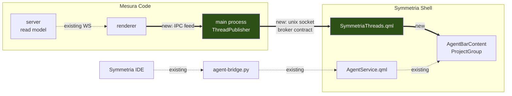

# Mesura Code's projects in the Symmetria Shell bar

## Context

The bar along the edge of the screen is where this desktop says what the machine
is doing. It lists the projects that are open and, beside each one, whether
something is working on it right now. That reading is the reason the desktop is
worth using, and today only one application feeds it. The moment the user moves
their coding work to Mesura Code, the bar goes quiet and the overview is gone.

This change makes Mesura Code report its projects and its threads to the shell,
so the bar keeps saying the same thing about the same work. The visual result is
meant to be indistinguishable from what the bar shows today, because the same
components draw it. Nothing new appears on screen except more of what is already
there.

## Current state

Symmetria Shell learns about agents from a hub script it launches itself and
reads line by line from that script's standard output. Each agent arrives as a
record carrying a project name, a title and an activity state, plus a host
process id. The bar's merged layout joins that process id to a compositor window
and from there to a Hyprland workspace, which is how a project's name comes to
sit beside a workspace number. That join is the whole reason the bar's default
layout mixes workspaces and agents together.

Mesura Code cannot take part in that join. It runs as one window holding every
project, so one process id would collapse every project onto one workspace. The
shell already has the layout that answers this: `Config.agentbar.mergeWorkspaces`
turns the merged view off, leaving plain workspaces along the top and a separate
bottom bar of project pills, and that bottom layout — `AgentBarContent.qml`
feeding `ProjectGroup.qml` — reads only a project name and a list of agents. No
window and no workspace.

The fork already owns a description of what it would publish.
`packages/symmetria-broker-contract` defines the thread projection, the surface
presence, the command envelope, the versioned draft and the stream framing, with
generated JSON Schema documents and two checksums. Its own README states the
gap this plan closes: it is a description, with no broker, no publisher, no
consumer and no storage. Two things in it are not yet fit for the bar. It
carries no project name — only an opaque `ProjectId` — so a consumer has nothing
to print above a group. And every field composing an upstream branded string
emits as a bare string in the generated JSON Schema, which issue #2 tracks and
which no consumer has yet been hurt by because no consumer outside TypeScript
has existed.

## What we will build

One read-only channel from Mesura Code to Symmetria Shell, carrying just enough
for the bar to draw a project pill per project and a chip per thread, over the
contract that already exists.

- **Publishes** each of Mesura Code's projects and threads on a Unix socket that
  the shell can read with no credential.
- **Names** a project on the wire, so a consumer has a word to print rather than
  an opaque identifier.
- **Streams** changes as they happen, opening with a snapshot and reporting a
  gap rather than repairing one.
- **Draws** those projects through the bar's existing project pill, so a Mesura
  pill and an IDE pill are the same components with the same typography.
- **Constrains** the generated JSON Schema so a consumer outside TypeScript is
  refused the same payloads the decoder refuses, closing issue #2.
- **Coexists** with Symmetria IDE without depending on it: a project worked in
  both lands in one pill, and removing the IDE later removes one source and
  leaves the other untouched.

## What we will NOT build

- Any mapping from a project to a Hyprland workspace. The bottom bar needs none,
  many projects will never have one, and no hook is left behind for it.
- Any write direction. No click-to-focus, no starting or interrupting a turn.
  The stream is read-only at both ends.
- Moving dictation onto the contract. The dictation socket keeps its own
  protocol and its own path.
- The project logo in the pill. The badge slot stays on its three existing
  cases; issue #12 records what actually blocks the image.
- Publishing surface presence. The contract describes it and the bar has no use
  for it.
- Removing Symmetria IDE from the shell. A separate cleanup, once Mesura Code is
  established.

## How, in outline

The publisher lives in the Electron main process, which is the only part of
Mesura Code that is always local and always one per machine, and which already
owns a Unix socket for dictation. It does not subscribe to the server itself:
the renderer already holds the thread read model and already renders it, so it
forwards a projection over an IPC channel and the main process republishes it.
That reuses the round trip dictation proved, at the cost of the publisher having
state only while a renderer is alive — which under the one-window decision is
always.

On the shell side the consumer is a sibling of the existing agent service, not a
feeder into it. `Quickshell.Io.Socket` connects straight to the socket with a
`SplitParser`, so no helper process is needed. `AgentBarContent.qml` unions two
independent sources into the pill list, which keeps the seam at `ProjectGroup`'s
own two properties — the narrowest interface available, and the one that
survives the day Symmetria IDE and its hub are deleted.

The work spans two git repositories, so it runs as two sequential cycles: phases
one to four in `mesura-code`, then phase five in `~/.config/quickshell/symmetria`.
That second repository carries two uncommitted files from the dictation feature
that must be committed before anything touches it.

One deviation from the cycle's usual shape is declared up front. Its per-phase
check step runs the whole test suite, and this repository forbids that in as
many words: a bare full run reached load 38 with swap exhausted and left the
machine unusable for roughly seventy minutes, which is issue #3. So each phase
runs the suites of **the packages it touches**, one package at a time with an
explicit worker bound, exactly as the repository's own guidance prescribes. The
full run belongs to CI, which has its own machine. Each phase's record names the
packages it ran.

## Done when

- The bottom bar shows one pill per Mesura Code project that has threads, with
  the project's name in caps and one chip per thread.
- A thread that is working animates the same way an agent working in Symmetria
  IDE does.
- The bar recovers on its own when Mesura Code is closed and reopened, without
  restarting the shell.
- A payload whose thread title is empty is refused by the generated JSON Schema,
  not only by the TypeScript decoder, and issue #2 can be closed.
- Nothing under `packages/contracts` has been edited.
- Dictation from the shell into the Mesura composer still works end to end.

## The phases

````json
[
  {
    "title": "Make the emitted schema carry its constraints",
    "goal": "A consumer outside TypeScript is refused the same payloads the decoder refuses, so the first such consumer does not inherit a schema that lies to it.",
    "files": [
      "packages/symmetria-broker-contract/src/primitives.ts",
      "packages/symmetria-broker-contract/src/threadSummary.ts",
      "packages/symmetria-broker-contract/src/surfacePresence.ts",
      "packages/symmetria-broker-contract/src/draft.ts",
      "packages/symmetria-broker-contract/schema/index.json"
    ],
    "acceptance": [
      "The emitted JSON Schema for a thread summary's title carries a minimum length and a non-blank pattern rather than a bare string type",
      "A thread summary payload whose title is the empty string is refused by the emitted JSON Schema document",
      "A thread summary payload whose title is only whitespace is refused by the emitted JSON Schema document",
      "Every projected timestamp field emits a constraint that the empty string fails",
      "A timestamp form the upstream IsoDateTime accepts still decodes after the change",
      "Both checksum and sourceChecksum in the schema index are regenerated and committed",
      "The excluded-upstream-fields privacy assertions pass unchanged"
    ],
    "detail": "This phase reverses a rule the package committed to in an earlier run, so the reversal has to be written down where the old rule is written down.\n\n### What is actually wrong\n\nEffect drops a check applied *after* a transformation when it emits JSON Schema. `TrimmedNonEmptyString` from `@t3tools/contracts` is built that way, so `SymmetriaThreadSummary.title`, `.branch`, `.worktreePath` and every `IsoDateTime` field emit as `{\"type\":\"string\"}` with no constraint. The same class of field appears in `surfacePresence.ts` (the two timestamps) and `draft.ts`.\n\nThe consequence is directional and is the opposite of the one `additionalProperties: true` was chosen to prevent: `{\"title\": \"\"}` validates against `schema/threadSummary.schema.json` and then fails `Schema.decodeUnknown(SymmetriaThreadSummary)`.\n\n### The pattern to copy already exists\n\n`primitives.ts` already declares `NonEmptyText` as `Schema.String.check(Schema.isMinLength(1), Schema.isPattern(/\\S/))`, with a docstring explaining exactly why: both checks sit directly on the string, so both reach the artifact as `{\"type\":\"string\",\"allOf\":[{\"minLength\":1},{\"pattern\":\"\\\\S\"}]}`. It deliberately does not trim, because a trimming codec is not the identity on the wire and a golden fixture would catch the round trip changing the document.\n\nSo the string half of this phase is: declare the affected fields on `NonEmptyText` instead of composing the upstream branded type.\n\n### The timestamp half needs a new primitive\n\nThere is no existing checked ISO-8601 value. Add one to `primitives.ts` beside `NonEmptyText`, built the same way — checks directly on the string so they survive emission.\n\nBe conservative about the pattern. The stated risk in issue #2 is refusing a timestamp form upstream accepts, which would turn a schema fix into a decode regression. Write a test that feeds it the exact forms `IsoDateTime` produces in this codebase before narrowing the pattern, and prefer a looser pattern that still fails the empty string over a strict one that might reject a valid form.\n\n### Two costs to accept, not to solve\n\nFirst, these fields lose their TypeScript brand, so a producer can pass an untrimmed string where it previously could not. That is the trade the issue names and the reason it was escalated rather than repaired in place.\n\nSecond, the timestamp primitive restates upstream vocabulary with no lock behind it. `upstreamLock.ts` locks types, not string formats, so nothing will fail if upstream changes its timestamp shape. Say so in the new primitive's docstring.\n\n### The docstring that has to change\n\n`primitives.ts` currently states the scope of the mitigation in as many words: *\"Upstream fields this projection composes keep whatever upstream chose — the loss only matters for identifiers Symmetria defines.\"* That sentence is now false. Replace it with what is true after this phase, and say why the rule was narrowed: the projection acquired a consumer that is not TypeScript.\n\n### Regeneration\n\n`vp run generate` rebuilds every document under `schema/`. `src/jsonSchema.test.ts` rebuilds each in memory and compares byte for byte, so a stale commit fails rather than passing. `schema/index.json` carries `checksum` (over the emitted bytes) and `sourceChecksum` (over the Effect schema trees). Both move here, and both moving is the expected outcome, not a problem to suppress.\n\nIssue #2 is closed by this phase. Reference it in the commit body."
  },
  {
    "title": "Give the projection a project record",
    "goal": "A consumer has a human-readable name for each project, so the bar can print a label instead of an opaque identifier.",
    "files": [
      "packages/symmetria-broker-contract/src/projectSummary.ts",
      "packages/symmetria-broker-contract/src/index.ts",
      "packages/symmetria-broker-contract/src/stream.ts",
      "packages/symmetria-broker-contract/src/version.ts",
      "packages/symmetria-broker-contract/schema/index.json"
    ],
    "acceptance": [
      "A project record carrying an identifier and a name decodes and re-encodes to the identical document",
      "A project record whose name is the empty string is refused by both the decoder and the emitted JSON Schema",
      "A stream snapshot carries a list of projects alongside its list of threads",
      "A stream delta can carry a project change tagged with the project entity",
      "A delta naming the project entity decodes as an unknown change under the previous minor protocol version rather than failing",
      "The protocol version's minor component is bumped and the bump is asserted",
      "The emitted JSON Schema names the new struct by its own identifier rather than a positional name",
      "Both checksums in the schema index are regenerated and committed"
    ],
    "detail": "### What the record is, and what it deliberately is not\n\n`SymmetriaProjectSummary` is two fields: `projectId` (re-exported `ProjectId`) and `name` (`NonEmptyText`). Nothing else — not the workspace root, not the scripts, not the icon path.\n\nThat restraint is not stylistic. `SYMMETRIA_THREAD_SUMMARY_EXCLUDED_UPSTREAM_FIELDS` already lists `workspaceRoot` and `scripts` with the reason: *\"a producer joining a thread to its project is exactly where project configuration gets folded into a thread row by accident, and the intent forbids project configuration on this wire.\"* A project-shaped struct is where that pressure lands next, so the new module needs its own excluded-fields value and its own privacy assertion, mirroring `threadSummary.ts`.\n\nThe icon path is the field somebody will want to add here first. It is out of scope and tracked as issue #12, whose first item is precisely that the shell cannot fetch what the current resolver returns.\n\n### Where it plugs into the stream\n\n`stream.ts` already has the union: `SymmetriaThreadChange` (`entity: \"thread\"`), `SymmetriaSurfaceChange` (`\"surface\"`), `SymmetriaDraftChange` (`\"draft\"`) and `SymmetriaUnknownChange`, listed as values in `SYMMETRIA_STREAM_CHANGE_ENTITIES` at line 144 and unioned in `SymmetriaStreamChange` at line 147. Add a `\"project\"` member to all three places, and add a project list to `SymmetriaStreamSnapshot` (line 171).\n\nAlso extend the delta application at line 353 onward, where the switch on `change.entity` lives. The docstring there notes that upsert must mean one thing across every entity kind; keep it meaning that.\n\n### Why this is a minor bump and not a major one\n\n`stream.ts` already documents the degradation: an unrecognized entity decodes as `SymmetriaUnknownChange` rather than failing the payload, precisely so *\"a minor bump is additive by definition, so a 1.1 producer may name an entity a 1.0 consumer has never heard of\"*. This addition is exactly that case, so it is a minor bump and the existing degradation path is what makes it safe. Assert it: a delta carrying a project change must decode as an unknown change when read as the previous minor version.\n\n### The identifier annotation is required\n\nBoth existing structs carry `.annotate({ identifier: \"...\" })` with a comment explaining why: without it Effect names reused definitions `Objects_`, `Objects_1` and so on, numbered by encounter order, so inserting one struct renumbers the rest and a consumer's pinned `$defs` pointer silently comes to mean a different shape. Adding a struct is exactly the insertion that comment warns about, so verify the existing pointers did not shift.\n\n### Ordering note\n\nThis phase lands after the constraint fix so `name` is declared on the corrected primitive from the start, rather than on the upstream branded string and then migrated."
  },
  {
    "title": "Publish a snapshot on a socket",
    "goal": "Anything on this machine can connect to a socket and receive Mesura Code's projects and threads as a valid contract snapshot, with no credential.",
    "files": [
      "apps/desktop/src/symmetria/socketFiles.ts",
      "apps/desktop/src/symmetria/UnixSocket.ts",
      "apps/desktop/src/symmetria/threadProjection.ts",
      "apps/desktop/src/symmetria/ThreadPublisher.ts",
      "apps/desktop/src/symmetria/sttSocketFiles.ts",
      "apps/desktop/src/symmetria/SttSocket.ts",
      "apps/desktop/src/main.ts"
    ],
    "acceptance": [
      "Connecting to the published socket yields one snapshot line before any other line",
      "The snapshot decodes against the contract's stream item decoder",
      "The snapshot's projects each carry a non-empty name derived from the source read model",
      "A thread whose provider session is running is reported with a liveness status that says so",
      "The socket file is created owner-only and is removed when the application exits",
      "A second connection while the first is open receives its own snapshot",
      "The existing dictation socket still binds and still delivers, on its own unchanged path"
    ],
    "detail": "### What already exists and must be shared, not copied\n\nThe dictation feature shipped four modules that are two thirds generic:\n\n- `sttSocketFiles.ts` — `sttSocketPath` is dictation-specific, but `prepareSocketPath` (directory at mode `0o700`), `restrictSocketPath` (`0o600`) and `removeSocketPath` are not.\n- `SttSocket.ts` — `createSttServer`, `listenOnPath` and `closeServer` are a plain `node:net` wrapper with nothing dictation-specific in them.\n\nExtract the generic halves into `socketFiles.ts` and `UnixSocket.ts`, leave the dictation-specific path builder where it is, and update the dictation call sites. Two socket servers in one process with two copies of the same bind-and-chmod dance is the duplication the project's own DRY rule names.\n\nDo the extraction as the first commit-shaped move inside this phase, with the dictation tests green before anything new is added — that keeps a regression in dictation attributable.\n\n### The projection is pure and is where the tests live\n\n`threadProjection.ts` takes the upstream read model shape and returns contract values. It holds no clock, no IO and no Effect services, exactly as `symmetriaSurfacePresenceFromLease` in the contract package does.\n\nBuild each summary field by field. The contract's own docstring warns against relying on Effect's key dropping as the mapping: *\"An upstream thread does not decode as a summary unchanged\"* — `OrchestrationThread` names its identity `id` where the summary names it `threadId`, and carries no `tokenUsage` at all, because token cost is `ThreadTokenUsageSnapshot` and reaches a producer separately. Treat the dropping as the guard that catches what you did not mean to include, not as the transformation.\n\nSupply `null` for an absent upstream value: every field the summary declares itself is required on the wire, and only `tokenUsage` keeps upstream's absent-key convention.\n\nThe project name comes from the project record's own name in the read model, not from the basename of a filesystem path — a path would be the project configuration this wire refuses.\n\n### The publisher\n\n`ThreadPublisher.ts` is an Effect `Layer` shaped like `SttDelivery.ts`: `Context.Service`, `Layer.effect`, `Effect.acquireRelease` for the socket lifetime. Read that module first — it is the working precedent for this process's socket handling, including the permanent `server.on(\"error\")` handler and the socket-path preparation order.\n\nIn this phase the read model comes from an **injected source**, not from the renderer. That is what lets the phase land green and independently checkable: a test provides a fixed read model and asserts the bytes on the socket. Phase four replaces the injection with the live feed.\n\nThe socket path belongs beside the dictation one under `$XDG_RUNTIME_DIR`, with the same fallback reasoning `defaultRuntimeDir` documents: `os.tmpdir()` is world-writable, so the fallback needs a per-user directory of its own.\n\n### Effect diagnostics are enforced at typecheck here\n\nThis package fails the typecheck on `node:fs` and `node:path` imports, on `setTimeout`, and on `crypto.randomUUID`. Use the `FileSystem` and `Path` services, `Effect.timeoutOption` and a counter or an injected id source. The existing dictation modules are split into three files precisely because those rules forced the split; expect the same pressure and let it shape the modules rather than fighting it.\n\n### Wiring\n\n`main.ts` composes layers; `SttDelivery.layer` is already a member of `desktopApplicationLayer` at line 191. The publisher joins the same list."
  },
  {
    "title": "Feed the socket from the live application",
    "goal": "Opening, renaming or working a thread in Mesura Code changes what a reader of the socket sees, without polling.",
    "files": [
      "apps/desktop/src/ipc/channels.ts",
      "apps/desktop/src/preload.ts",
      "apps/desktop/src/symmetria/ThreadPublisher.ts",
      "apps/web/src/symmetria/threadFeed.ts",
      "apps/web/src/symmetria/useThreadFeed.ts"
    ],
    "acceptance": [
      "A change to the renderer's thread read model produces a delta on the socket",
      "Each delta carries a sequence one greater than the previous one",
      "A reader that connects mid-session receives a snapshot whose revision matches the last delta applied",
      "A renderer reload produces a fresh snapshot rather than a delta continuing the old sequence",
      "The publisher keeps serving the last known state when no renderer is attached, rather than serving nothing",
      "The renderer sends nothing when the projection is unchanged"
    ],
    "detail": "### The direction is renderer to main, which is the reverse of dictation\n\nThe dictation channel pair (`STT_DELIVER_CHANNEL`, `RESOLVE_STT_DELIVER_CHANNEL` in `apps/desktop/src/ipc/channels.ts`) sends main to renderer and awaits an answer. This feed goes the other way and awaits nothing: the renderer pushes, the main process republishes.\n\nThe rejected alternative is recorded in the intent — a second WebSocket client in the main process authenticated through `DesktopLocalEnvironmentAuth.getBearerToken`. It was refused as a duplicate subscription and a second auth path for state the renderer already holds. The cost accepted in exchange is the one this phase has to handle honestly: **the publisher has state only while a renderer is alive.** Hence the acceptance criterion that it keeps serving the last known state rather than blanking.\n\n### Sequence and revision are the contract's, not invented\n\n`stream.ts` borrows both meanings from upstream: `OrchestrationReadModel.snapshotSequence` is already the fork's own snapshot revision, the position in the event sequence a snapshot reflects. Carry that through rather than counting locally, so a consumer's gap detection means what the contract says it means.\n\nThe three framing rules the module states apply to the producer as much as the reader: a stream opens with a snapshot; a gap is reported and never repaired; a duplicate is normal traffic after a reconnect and is applied once. The producer's job here is to never *create* a gap — a delta whose sequence skips forces every reader to resnapshot.\n\n### A renderer reload is a discontinuity and must look like one\n\nWhen the renderer reloads, its subscription restarts and its sequence has no relationship to the previous one. Emitting a delta across that boundary is exactly the silent gap the framing forbids. Emit a snapshot instead, and treat it as the ordinary case rather than an error path — it happens on every dev reload.\n\n### Do not send unchanged projections\n\nThe renderer's read model updates far more often than the projection changes, because most of what moves is transcript content the projection drops. Compare the projected value before sending. Without that the socket carries a delta per token of streaming assistant output, for a payload that is byte-identical each time.\n\n### Cross-thread and lifecycle discipline\n\nThe publisher's state is touched from the IPC handler and read by each socket connection. Keep the mutation on one path so a connection opening mid-update cannot observe a half-written snapshot."
  },
  {
    "title": "Draw Mesura's projects in the bar",
    "goal": "The user sees Mesura Code's projects and their working threads in the bottom bar, drawn by the same components that draw Symmetria IDE's.",
    "files": [
      "services/SymmetriaThreads.qml",
      "modules/agentbar/AgentBarContent.qml",
      "config/AgentBarConfig.qml",
      "config/shell.json"
    ],
    "acceptance": [
      "A project published by Mesura Code appears as its own pill in the bottom bar",
      "A thread that is working shows the same animated indicator an IDE agent shows",
      "Closing Mesura Code removes its pills without disturbing the pills the IDE publishes",
      "Reopening Mesura Code restores its pills without restarting the shell",
      "A project worked in both Symmetria IDE and Mesura Code renders as one pill carrying both sets of chips",
      "The top bar shows plain workspaces with no agent content",
      "Every Mesura thread renders with the Claude indicator, whichever provider backs it"
    ],
    "validationSuggested": "The result is a strip of pills whose typography, spacing and animation have to be indistinguishable from the ones beside them — a diff shows the properties bound, not whether the two sets actually look like siblings on the screen.",
    "detail": "**This phase runs in a different repository:** `~/.config/quickshell/symmetria`, branch `dev`. Its file paths above are relative to that root.\n\n**Precondition.** That repository currently has two uncommitted files — `scripts/stt-inject.sh` and `services/SttJob.qml` — which are the shell half of the dictation feature shipped 2026-08-22. They must be committed before this phase starts, both because the cycle requires a clean tree and because that work is currently unprotected.\n\n### The socket is read directly; no helper process is needed\n\n`AgentService.qml` reads its agents from a `Process` running `agent-bridge.py`, parsing standard output with a `SplitParser` (around line 633). Do not copy that shape. `Quickshell.Io.Socket` exists in the installed Quickshell — verified in `/usr/lib/qt6/qml/Quickshell/Io/quickshell-io.qmltypes`, where `Socket` has `path`, `connected`, `write` and `flush`, and its prototype is `DataStream`, so it carries a `parser`. A direct connection with a `SplitParser` is the whole transport:\n\n```qml\nSocket {\n    path: ...\n    connected: true\n    parser: SplitParser { onRead: line => ... }\n}\n```\n\nReconnection matters here and has no equivalent in the `Process` path: Mesura may not be running when the shell starts, and may be restarted under it. Retry on disconnect with a backoff, and treat \"no socket\" as the ordinary empty state rather than an error to surface.\n\n### The service is a sibling, not a feeder\n\nDo **not** merge these rows into `AgentService.agents`. Symmetria IDE and its hub are deliberately temporary, and `agent-bridge.py` plus half of `AgentService.qml` is what gets deleted when the IDE goes. The seam is `ProjectGroup`'s own interface — `project: string` and `agents: array` — and nothing above it.\n\n`AgentBarContent.qml` is currently sixteen lines of body: a `RowLayout` with a `Repeater` over `AgentService.sortedProjects`, each row a `ProjectGroup` filtered by `a.project === modelData`. It becomes a union of two sources keyed by project name. A project name present in both yields one `ProjectGroup` whose `agents` is the concatenation — which is the acceptance criterion about a shared project, and it falls out of grouping by name rather than needing code of its own.\n\n### The chip is the shared one, and every thread wears Claude\n\n`AgentChip` from the installed `Symmetria.Agents.UI` module draws the indicator. It requires `active`, `activityState`, `activityTool` and `isSttTarget`, and takes an optional `agentType` defaulting to `\"\"`.\n\n**Leave `agentType` unset.** `_isOpenCode` is `agentType === \"opencode\"` and `_accentColor` falls back to `claudeAccent` for anything else, so an unset value yields the Claude sparkle in Claude orange — the decided v1 behaviour for every Mesura thread, whichever provider backs it.\n\nThat is a knowingly false attribution for a Codex thread. It is accepted deliberately and only because the wire cannot say otherwise: `SYMMETRIA_THREAD_SUMMARY_EXCLUDED_UPSTREAM_FIELDS` lists `providerName` and `providerInstanceId`, and `SymmetriaThreadLiveness`'s docstring states the projection reports what a session is doing *\"without saying anything about the provider itself\"*. Do not work around it by inferring a provider from anything else on the wire. A follow-up issue tracks adding provider identity to the contract properly.\n\nFor `activityState`, use the vocabulary `AgentChip` already branches on: `_isBusyState` accepts `\"working\"`, `\"thinking\"`, `\"starting\"` and `\"clearing\"`, and treats anything else as idle. v1 needs only the busy/idle distinction, so map a running session to `\"working\"` and everything else to the empty string. Read how `AgentChipGroup.qml` passes these through today rather than inventing a second convention.\n\nPass `isSttTarget: false` and `sttIsTranscribing: false`. Dictation presence is not on this wire at all, so there is no value to pass — that is absence of data, not a feature switched off.\n\n### The layout switch\n\n`Config.agentbar.mergeWorkspaces` defaults to `true` in `config/AgentBarConfig.qml` line 8, with the serialized value in `config/shell.json`. Set it to `false`.\n\nThat is a deliberate, accepted loss and not a side effect: the IDE's own agents lose their workspace association in the top bar too, for as long as the IDE is still in use. It is recorded as a decision in the intent. `AgentService.mergeActive` reads the flag, so nothing else needs changing.\n\n### One thing that is not a bug\n\n`AgentService.sortedProjects` sorts projects by workspace, and its own comment gives category 3 to *\"no workspace detected → far right\"*. Mesura's projects have no workspace, so they will sort to the right of the IDE's. That is correct behaviour for this layout and is not a defect to fix here."
  }
]
````

## Architecture



Legend: thick arrows are built by this plan, dotted arrows already exist and are
not touched. Filled nodes are new modules. The two paths meet only at
`AgentBarContent`, which is what lets the dotted lower branch be deleted later
without touching the upper one.

## Open questions

- **Does the renderer's read model expose a project name directly, or only a
  workspace root to take a basename of?** The wire refuses project configuration,
  and a filesystem path is configuration. If only a path is available, the
  producer takes the basename in the main process and publishes only the result.
  Settled that way by approval unless the tree says otherwise in phase three.
- **How narrow should the checked ISO-8601 pattern be?** Narrow enough that the
  empty string fails, loose enough that no form the upstream timestamp produces
  is refused. Phase one resolves it by measuring against the forms actually
  emitted, not by choosing a canonical grammar.
- **Does anything else already read the two checksums?** If a second repository
  pins them, moving them twice in two phases is two notifications rather than
  one. No such consumer is known.

## Risks

- **The timestamp constraint refuses a valid form.** A decode regression
  disguised as a schema fix, and it would surface as threads silently missing
  rather than as an error. Caught by a phase-one test that feeds the primitive
  the forms this codebase actually produces before the pattern is narrowed.
- **The extraction in phase three breaks dictation.** Two socket servers now
  share the bind-and-chmod code. Caught by running the dictation suites before
  anything new is added, and by the phase-three acceptance criterion that keeps
  dictation on its own unchanged path.
- **The renderer feed floods the socket.** The read model updates per streaming
  token while the projection rarely changes. Caught by the phase-four criterion
  that an unchanged projection sends nothing.
- **The shell repository loses its uncommitted dictation work.** Two modified
  files there are the only copy. Caught by making the commit a precondition of
  phase five rather than a step inside it.
- **The unmerged bar is worse to live with than expected.** It is a
  configuration flag, so the fallback is one value, and nothing else in the plan
  depends on it.

## Decisions

**The wire is the broker contract; the shell adapts it.**
Rejected: Mesura speaking the existing hub protocol, which needs no shell work
and would run this week. That protocol addresses an agent as process id plus
slot, and the contract exists in as many words to replace it — a slot number is
reused, and a reused address delivers a command to the wrong thread.

**The publisher lives in the Electron main process.**
Rejected: publishing from the server, which owns the read model and already
emits a thread stream. The same server also runs over SSH, inside WSL and in the
cloud, and a server on a remote host has no business writing to a socket on this
machine.

**The main process takes its state from the renderer.**
Rejected: a second WebSocket client in main with its own bearer. A duplicate
subscription and a second auth path for state the renderer already holds. The
cost — state only while a renderer lives — is bounded by the one-window
decision and has to be revisited if that is ever reversed.

**The shell's service is a sibling of the agent service, not a feeder into it.**
Rejected: projecting into the existing agent records so the whole current
pipeline carries them. Symmetria IDE and its hub are deliberately temporary, and
that pipeline is what gets deleted; the seam belongs at the narrowest interface
that survives the deletion.

**The projection gains a project record rather than a name on every thread.**
Rejected: a project name field on the thread summary. The name would repeat on
every thread and two could disagree, a project with no active thread would
vanish, and the logo will need a project-shaped record anyway.

**Issue #2 is closed here, first.**
Rejected: leaving it, since a laxer schema than decoder has never hurt anyone.
It has never hurt anyone because there has never been a consumer outside
TypeScript, and this work ships the first one — against the field the bar prints.

**The bar runs unmerged.**
Rejected: keeping the merged layout and finding a place in it for windowless
threads. The merged layout is organized by workspace and this work has none.

**Every Mesura thread renders as Claude, including the ones that are not.**
Rejected: a provider-neutral indicator of Mesura's own, and rejected separately:
adding provider identity to the contract now so Codex could have its own mark.
The wire refuses provider identity by design, so nothing on it can distinguish
them, and a neutral third mark would cost a component and a brand colour that do
not exist yet. Distinguishing them does matter and is wanted; it is deferred to a
follow-up that adds provider identity to the contract deliberately, because the
exclusion's stated reason — that a shell needs none of it to render a row — is
what this consumer has just falsified.

**Each phase runs only its own packages' suites.**
Rejected: the cycle's usual whole-suite step. A bare full run in this repository
is measured at load 38 with swap exhausted and seventy minutes of unusable
machine, and this run is unattended overnight. The full suite is CI's, on its own
host.

## What I read before planning

- `~/.config/quickshell/symmetria/modules/agentbar/` — `AgentBarContent.qml`,
  `ProjectGroup.qml`, `ProjectNameLabel.qml`, `MergedBarContent.qml`,
  `MergedWorkspacePill.qml`, `Wrapper.qml`
- `~/.config/quickshell/symmetria/services/AgentService.qml` — the bridge
  `Process` and `SplitParser`, `mergeActive`, `sortedProjects`
- `~/.config/quickshell/symmetria/scripts/agent-bridge.py` — `_snapshot_line`,
  `_resolve_terminal_pid`, `_host_window_pid_from_environ`
- `~/.config/quickshell/symmetria/config/AgentBarConfig.qml` and `Config.qml`
- `/usr/lib/qt6/qml/Quickshell/Io/quickshell-io.qmltypes` — the `Socket` type's
  properties and its `DataStream` prototype
- `mesura-code/packages/symmetria-broker-contract/` — `README.md`, `src/index.ts`,
  `primitives.ts`, `threadSummary.ts`, `surfacePresence.ts`, `stream.ts`,
  `command.ts`
- `mesura-code/apps/desktop/src/symmetria/` — the four dictation modules
- `mesura-code/apps/desktop/src/main.ts`, `ipc/channels.ts`,
  `backend/DesktopLocalEnvironmentAuth.ts`, `backend/DesktopBackendPool.ts`
- `mesura-code/apps/server/src/project/ProjectFaviconResolver.ts`,
  `assets/AssetAccess.ts`, `ws.ts`
- `mesura-code/packages/contracts/src/t3ProjectFile.ts`
- `mesura-code/docs/mesura/adr-002-one-window-many-projects.md`
- `gh issue list` and `gh issue view 2` on `CaceresCallieri/mesura-code`
- `git status` and `git log` in both repositories
