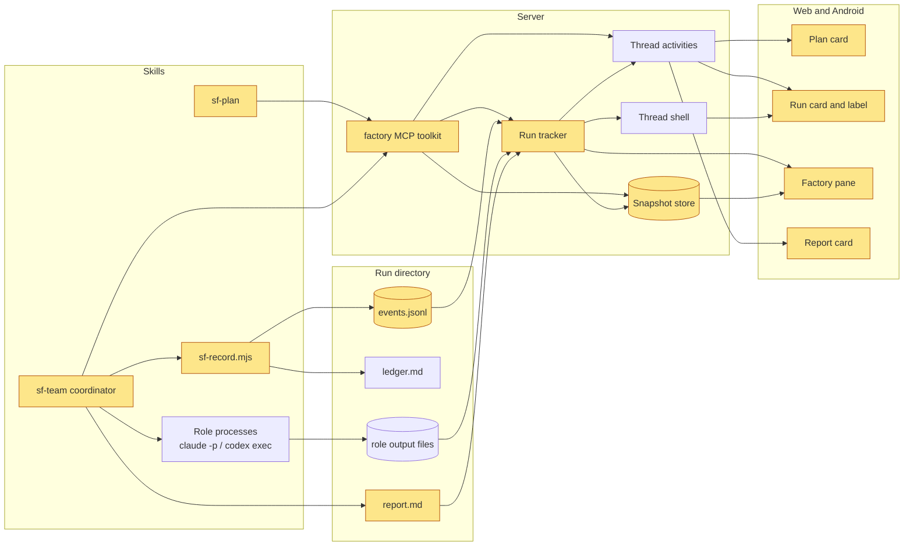

# Plan: the Software Factory inside Mesura Code

## Context

Mesura Code is the app the developer uses every day to direct coding agents, on the desktop and from an Android phone. Two skills turn a large change into a planned, multi-agent build. The planning skill interviews the developer and writes a plan. The team skill then builds that plan phase by phase: one agent writes the code, a second agent checks that it works, and a third reviews it.

Today the app sees none of this. The plan arrives as a link to a separate web page. During a build the chat shows only a long stream of background commands, about a thousand in a large run, with no sign of which phase is running, which step it is on, or what the reviewers said. The only account at the end is a dense list that makes sense only to someone who watched the whole run. After this change, the plan appears in the chat as a card the developer can read and open full-screen. At the foot of the card the developer chooses which model writes the code, which one reviews it and which one checks it, then approves with one button. A running build shows its phase and step in the chat, in the sidebar and in a dedicated pane. When the build ends, a report written for a reader who did not watch appears in the chat. All of it works on the desktop and on the phone.

## Current state

**Planning.** The planning skill writes three files in a directory under `/home/dev/plans/<slug>/`: `plan.md` (the plan, written to a fixed list of level-two headings, with its phases as a fenced JSON block), `intent.md` (what was agreed), and `plan.html` (a page rendered by `render-plan-page.mjs` from the Pi checkout `~/projects/pi-agent-stable`). It serves that page with `tailscale serve` and sends a URL. The developer approves with a sentence; nothing records which bytes were approved.

**Building.** The team skill (`sf-team`, in the agent-env repository `/home/dev/.agent-env`, skill files in `skills/core/sf-team/`) runs inside an ordinary Mesura Code thread. The agent in that thread is the coordinator. It starts each role as a background shell command (`claude -p … --output-format json`, `codex exec --json`) and writes the prompt and the report of every turn into a run directory, `~/projects/factory-runs/<slug>/`. Its only record is `ledger.md`, free text it edits by hand at every step. The Claude adapter sees only the coordinator's shell calls: the thread "Standardize Chatbot Launch Operations" holds about 1,100 tool calls and 350 background tasks, and no phase, node, verdict or cost. The report is a chat message listing six items in the run's own vocabulary.

**What the app already has.** The app runs an MCP server, `t3-code`, for every agent in a thread (`apps/server/src/mcp/McpHttpServer.ts`); `link_pull_request` already turns a tool call into a persisted thread event that every client renders live. A thread activity (`OrchestrationThreadActivity`, a record with an open `kind` and an untyped `payload`) that is written again with the same id replaces the earlier one in place. The right panel has a surface system and a Maximize control. Upstream's plan-mode card renders a plan inline. The files panel already renders an `.html` file. Nothing in the app renders a Mermaid diagram, and the Android app has no plan card and no phase view.

## What we will build

The two skills become first-class in the app. A plan is presented into the thread, read and approved there. A build is followed live from three places. Its report is a document a newcomer can read.

- **Presents** a plan in the thread as a native card, with the whole plan in a Factory pane that can be maximized, on the web and as a full screen on Android.
- **Chooses** the model and reasoning level of each role at the foot of the plan card. The defaults are the newest Opus at high for the implementer, the newest Sol at high for the reviewer and the newest Luna at max for the verifier.
- **Approves** a plan with one button that records the digest of the exact bytes approved, carries the chosen routes, and starts the build in the same thread.
- **Records** every build as an events file in its run directory, from which the skill also generates `ledger.md`.
- **Follows** a live build through a run card in the timeline, a status label on the thread (for example `phase 5/11 · Review`), and the Factory pane with the phases, the nodes, the role sessions and their live progress.
- **Reports** the end of a build in the engine's report format: the clock, the verification table and the step-by-step record drawn from the events, and the story written by the coordinator.
- **Draws** Mermaid diagrams in plans and reports, loaded only when one is shown.

## What we will NOT build

- A screen that lists every run across projects. It is issue #65.
- Any control of a run from the app: answering a stop question from a card, stopping or resuming a run. The app only shows.
- "Approve and build in a new thread". Approve builds in the same thread.
- A child agent's session opened as a read-only thread.
- Support for `sf-solo`, `sfactory`, `sf-full` or the Pi engine as builders.
- Changes to the plan heading contract or to `render-plan-page.mjs`; `plan.html` keeps being written. Everything else out of scope is listed in `intent.md`.

## The design we agreed

The shape that won: the run directory is the source of truth, and the app watches it. The coordinator appends one line per step to an events file through a small recorder script shipped with the skill. The same script regenerates `ledger.md`, so there is one record. The skill tells the app about a plan and a run through two MCP tools, and it behaves as today where the tools are absent. The developer's own words on scope: "The only thing that we are using now is sf-plan and sf-team, disregard other factories or skill."

- **MCP calls at every step** were dropped: a forgotten call leaves the view stale, and it would tie the skill to the app.
- **The Pi engine's published run view** was dropped as the format, because the engine is not in use.
- **The plan page embedded in a frame** was dropped for a native card with feature parity, "but with feature parity and the possibility to maximize it", because a frame is heavy on the phone.
- **A pane that opens by itself** was dropped because upstream removed its plan side panel for exactly that, in #5558, "fix(web): plans stop hijacking the UI, fold into chat instead".
- **Folding the coordinator's tool calls under the run card** was dropped; the developer chose "Show".
- **The team skill's six-item report** was dropped for the engine's report contract, whose rule is that the numbers are derived and only the prose is written.
- **Building in a new thread after Approve** was deferred: "just approve to build here for now".
- **Routes chosen only inside the team skill** (its `ROUTES.md` or its gate) were dropped for a route picker on the plan card. The developer asked for "implementer, reviewer, verifier, model selection" with "Opus 5.5, or if we can do the latest Opus even better, with high reasoning", "Sol 6, high reasoning, the latest Sol if it can be done", and "Luna on Max".

## How, in outline

Everything that crosses the wire is typed in a new contracts module, `packages/contracts/src/factory.ts`. Two pure modules in `packages/shared` are shared by the server and both clients: a document parser that splits a plan or a report into its level-two sections and reads the phase list, and a fold that turns the events of a run into its state. The server grows a `factory` MCP toolkit beside the pull-request one, a store that keeps plan and report bytes under their sha256 digest, and a run tracker that follows a run's events file and its roles' output files. The tracker writes three kinds of activity (`factory.plan`, `factory.run`, `factory.report`), each small, each replaced in place. It also fills an optional summary field on the thread shell for the sidebar, and serves the full state and live role progress through one stream that only an open pane subscribes to. Document bodies travel only on demand, by digest.

The web app adds a Factory surface to the right panel with Plan, Run and Report tabs, three timeline rows, and a label on the sidebar row. The plan card ends with a route picker built from the provider model lists the server already sends to the composer. A shared module in `packages/client-runtime` resolves the newest model of a family and enforces the team skill's two routing rules. Android adds the same cards to the thread feed, a full-screen Factory screen, and the label on the thread list row. The skills change in the agent-env repository: the planning skill presents the plan, accepts the Approve message and passes its routes to the team skill as a routes file; the team skill records events, attaches its run, streams its Claude roles' output, and writes a report file to the report contract. New code goes in new files. The edits inside upstream files are wiring, and their cost is listed per phase.

## Done when

- A plan presented from a thread appears as a card on the web and on Android. It opens full-size and draws its diagram.
- The card offers a route per role with the newest Opus, Sol and Luna as defaults. Approve records the plan's digest, and the run uses the chosen routes.
- An `sf-team` run attached to a thread shows its phase and node on the run card, in the sidebar label and on the Android thread list, and in the Factory pane with live role progress.
- The skill generates `ledger.md` from the events file, and a run started outside Mesura Code still completes and writes both files.
- The end of a run shows a report card whose clock, verification table and step record come from the events, and whose prose comes from `report.md`.
- The server keeps following a live run after a restart.
- Upstream's plan-mode card, the existing MCP tools and the persisted right-panel state are unchanged.

## The phases

```json
[
  {
    "title": "Snapshot a plan and present it to the thread",
    "goal": "An agent in a thread calls `present_plan`. The server validates the plan, keeps the exact bytes under their digest, and records one plan activity that clients can render. Clients read the bytes back by digest.",
    "files": [
      "packages/contracts/src/factory.ts",
      "packages/contracts/src/index.ts",
      "packages/contracts/src/rpc.ts",
      "packages/shared/src/factoryDocument.ts",
      "packages/shared/src/factoryDocument.test.ts",
      "packages/shared/package.json",
      "apps/server/src/config.ts",
      "apps/server/src/factory/FactorySnapshotStore.ts",
      "apps/server/src/factory/FactorySnapshotStore.test.ts",
      "apps/server/src/mcp/McpInvocationContext.ts",
      "apps/server/src/mcp/McpSessionRegistry.ts",
      "apps/server/src/mcp/McpProviderSession.ts",
      "apps/server/src/mcp/toolkits/factory/tools.ts",
      "apps/server/src/mcp/toolkits/factory/handlers.ts",
      "apps/server/src/mcp/toolkits/factory/handlers.test.ts",
      "apps/server/src/mcp/McpHttpServer.ts",
      "apps/server/src/provider/Layers/ProviderService.ts",
      "apps/server/src/auth/RpcAuthorization.ts",
      "apps/server/src/ws.ts",
      "apps/server/src/server.ts"
    ],
    "acceptance": [
      "`present_plan` with absolute paths to a valid `plan.md` and `intent.md` returns the plan's sha256 digest, its title and its phase count",
      "The exact bytes of both files are stored under the server's factory snapshots directory, named by their sha256, and a second call with unchanged files writes nothing new",
      "The thread gains one activity of kind `factory.plan` whose payload carries both digests, both paths, the title, each phase's title and acceptance count, and the level-two headings in order, and no document body",
      "Presenting the same plan path again after an edit replaces that activity in place with the new digest, so a thread holds one plan activity per plan file",
      "A relative path, a missing file, a file over 1 MiB, or a plan whose phase block does not parse returns a tool error naming the cause and records no activity",
      "The `factoryReadSnapshot` RPC returns the stored markdown for a known digest, refuses a digest that is not 64 lowercase hex characters, and reports not-found for an unknown one",
      "Every provider session's MCP credential grants the `factory` capability, and `present_plan` refuses a credential without it",
      "The document parser keeps every level-two section in document order, including headings it does not know, and ignores `## ` lines inside fenced code blocks"
    ],
    "detail": "**Contracts.** Create `packages/contracts/src/factory.ts` and export it from `packages/contracts/src/index.ts` beside the other `export *` lines. It holds:\n\n- `FACTORY_PLAN_ACTIVITY_KIND = \"factory.plan\"` (and, for later phases, `factory.run` and `factory.report`), the same pattern as `WORKTREE_SETUP_ACTIVITY_KIND` in `packages/contracts/src/worktreeSetup.ts:82-83`.\n- `FactoryPlanActivityPayload`: `{ digest, intentDigest, planPath, intentPath, title, phases: [{ title, acceptanceCount }], headings: string[], presentedAt }`. No body.\n- `FactorySnapshotDigest`: a string matching `^[0-9a-f]{64}$`.\n- The RPC input, result and tagged error for `factoryReadSnapshot`, following `OrchestrationGetWorkflowScriptInput`/`Result`/`Error` in `orchestration.ts:2243-2299`.\n\nAdd `factoryReadSnapshot` to `WS_METHODS` and declare the unary RPC in `packages/contracts/src/rpc.ts` beside `WsSubscribeProjectFileRpc` (L1055). Register it in the group list (L1570 area). Give it `AuthOrchestrationReadScope` in `apps/server/src/auth/RpcAuthorization.ts` (the map is checked for exhaustiveness). Implement it in `apps/server/src/ws.ts` with `observeRpcEffect`, next to the `getWorkflowScript` handler (L1920).\n\n**Parser.** `packages/shared/src/factoryDocument.ts`, exported as `@t3tools/shared/factoryDocument` in `packages/shared/package.json`:\n\n- `splitFactoryDocument(markdown)` returns `{ title, sections: [{ heading, body }] }`. Split on lines that start with `## ` outside fenced code blocks (track ``` and ~~~ fences). Keep document order. Never drop a section.\n- `readFactoryPhases(sections)` finds the section headed `The phases` and parses the first fenced `json` block in it. It returns `{ ok: true, phases }` or `{ ok: false, reason }`. Each phase keeps `title`, `goal`, `files`, `acceptance`, `detail` and `validationSuggested` when present.\n- The title is the first `# ` line.\n\nThis module is pure: no Node APIs, no ES2023 array methods (the mobile lint `t3code/no-hermes-unsupported-array-methods` covers code the phone imports). Test it with this repository's plan, `/home/dev/plans/mesura-code-factory-in-chat/plan.md`, copied into a fixture, and with a synthetic plan whose `json` fence contains a `## ` line.\n\n**Snapshot store.** `apps/server/src/factory/FactorySnapshotStore.ts` is a `Context.Service` with `put(bytes) -> digest` and `read(digest)`.\n\n- Add `factorySnapshotsDir: join(stateDir, \"factory-snapshots\")` to `ServerDerivedPaths` and `deriveServerPaths` in `apps/server/src/config.ts` (beside `browserArtifactsDir`, L49 and L153). Create the directory lazily, as `McpHttpServer.ts:306` does for browser artifacts.\n- Write to a temporary name, then rename. Skip the write when the file exists.\n- `read` validates the digest shape before any path join. The client never sends a path.\n- Provide the layer in `apps/server/src/server.ts` where both transports share service instances (`makeRoutesLayer`, L607-636, comment at L628).\n\n**The toolkit.** Copy the shape of `apps/server/src/mcp/toolkits/pullRequests/` into `toolkits/factory/`:\n\n- `tools.ts`: `Tool.make(\"present_plan\", { parameters: { planPath, intentPath }, success, failure, dependencies })`, annotated not read-only and idempotent. Also `FactoryToolkit = Toolkit.make(PresentPlanTool)`.\n- `handlers.ts`: `requireMcpCapability(\"factory\")`, then:\n  1. Read both files, which must be absolute paths to regular files of at most 1 MiB.\n  2. Parse the plan and refuse it when `readFactoryPhases` fails.\n  3. Store both files.\n  4. Dispatch `thread.activity.append` with `commandId` `server:factory-plan:${threadId}:${uuid}` (the convention in `pullRequests/handlers.ts:151-155`).\n- The activity uses kind `factory.plan`, tone `info`, summary `Plan: <title>`, `turnId: null` and `createdAt: now`, so a re-presented plan moves to the end.\n- Its id is `factory-plan:${threadId}:${first 16 hex of sha256(planPath)}`, which keeps one activity per plan file. `projector.ts:1037-1057` replaces by id.\n\nRegister `FactoryToolkitRegistrationLive` in `McpHttpServer.ts` beside `PullRequestsToolkitRegistrationLive` (L607-609) and add it to `layer` (L631-635).\n\n**The capability.**\n\n- Add `\"factory\"` to `McpCapability` (`McpInvocationContext.ts:11`).\n- Grant it where `pull-requests` is granted: `McpSessionRegistry.ts:132-135` and `ProviderService.ts:907-915`.\n- Update the doc comment at `McpProviderSession.ts:10` and the tests that pin the capability sets: `McpSessionRegistry.test.ts:81-83`, `ProviderService.test.ts:5077-5148`, and the tool-list assertions in `McpHttpServer.test.ts:371-401`.\n\n**Tests.** `handlers.test.ts` follows `pullRequests/handlers.test.ts`:\n\n- `Layer.mock` for the engine and the snapshot query, with `dispatch` recording into a `Ref`.\n- `toolkit.handle(...)` driven under a provided `McpInvocationContext`.\n\n`FactorySnapshotStore.test.ts` uses a temporary directory. Run each with `vp test run <file>` from `apps/server` or `packages/shared`.\n\n**Upstream cost.** Wiring lines in `McpHttpServer.ts` (10 upstream commits in 3 months), `ProviderService.ts`, `rpc.ts`, `ws.ts` (95) and `config.ts`. Everything else is new files.\n\n**How a witness reaches it.** Run the worktree's dev instance with a seeded `.t3` (AGENTS.md, *Test data*). Open a Claude thread and ask the agent to call `present_plan` with the paths of this plan and its intent. Then read `projection_thread_activities` in the worktree's `.t3/userdata/state.sqlite` read-only, and list `.t3/userdata/factory-snapshots/`."
  },
  {
    "title": "Render the plan card and the Factory pane on the web",
    "goal": "A presented plan shows as a card in the web timeline and opens full-size in a Factory surface of the right panel that can be maximized and draws its diagram.",
    "files": [
      "packages/client-runtime/src/state/factory.ts",
      "packages/client-runtime/src/work-log/presentation.ts",
      "packages/client-runtime/package.json",
      "apps/web/package.json",
      "apps/web/src/factory/FactoryPlanCard.tsx",
      "apps/web/src/factory/FactoryPlanDocument.tsx",
      "apps/web/src/factory/FactoryPane.tsx",
      "apps/web/src/factory/MermaidDiagram.tsx",
      "apps/web/src/factory/mermaidLoader.ts",
      "apps/web/src/factory/factoryPlanTimeline.ts",
      "apps/web/src/factory/factoryPlanTimeline.test.ts",
      "apps/web/src/session-logic.ts",
      "apps/web/src/components/chat/MessagesTimeline.logic.ts",
      "apps/web/src/components/chat/MessagesTimeline.logic.test.ts",
      "apps/web/src/components/chat/MessagesTimeline.tsx",
      "apps/web/src/components/ChatMarkdown.tsx",
      "apps/web/src/rightPanelStore.ts",
      "apps/web/src/rightPanelStore.test.ts",
      "apps/web/src/components/RightPanelTabs.tsx",
      "apps/web/src/components/ChatView.tsx",
      "apps/web/src/routes/_chat.pull-requests.tsx"
    ],
    "acceptance": [
      "A `factory.plan` activity renders as a plan card at its place in the timeline, with the title, the Context section, the phase count and one line per phase with its acceptance count, and it never renders as a tool row",
      "Presenting a revised plan moves the card to the end of the timeline with the new content, and the thread still shows one card per plan file",
      "Open shows the whole plan in a Factory surface of the right panel, maximized, Restore returns it to side width, and the surface never opens by itself",
      "The Factory pane renders every section in document order, draws each phase as a card with goal, files and numbered acceptance criteria, folds each phase's detail and each decision's argument, and states the section count",
      "A `mermaid` code block renders as a diagram in the pane and in chat markdown, the library loads only when a diagram is shown, and a diagram that fails to parse shows its source and the error",
      "Right-panel state persisted under the previous storage version still loads, and the proposed-plan card and its Implement flow behave as before"
    ],
    "validationSuggested": "Feature parity with plan.html and the feel of the card, the pane and Maximize are judgements a diff cannot settle.",
    "detail": "**Shared client pieces (`packages/client-runtime`, used again by phase 3).**\n\n- `src/state/factory.ts`: a `factorySnapshot` query atom family on `WS_METHODS.factoryReadSnapshot`, shaped like `workflowScript` (`src/state/orchestration.ts:15-21`), with a long `staleTimeMs` since a digest's content never changes. Add the subpath to `exports`.\n- In `src/work-log/presentation.ts`, extend the predicate beside `isWorktreeSetupActivity` (L19-25) with `isFactoryActivity(kind)` for `factory.plan`, `factory.run` and `factory.report`. Skip it in `apps/web/src/session-logic.ts` `deriveWorkLogEntries` (the skips at L471-492). The mobile skip lands in phase 3.\n\n**Timeline.** A plan card is time-ordered like a proposed plan: a new `TimelineEntry` kind, not a side input like `worktree-setup`.\n\n- The derivation lives in `apps/web/src/factory/factoryPlanTimeline.ts`: the latest `factory.plan` activity per id, decoded with the contracts schema.\n- `session-logic.ts`: add `\"factory-plan\"` to `TimelineEntry` (L135-153) and `timelineEntrySourceOrder` (L1487-1496), and pass the entries to `deriveTimelineEntriesWithState` (L1676) with its prefix fast paths kept for the new input; caller at `ChatView.tsx:3445-3461`.\n- In `MessagesTimeline.logic.ts`:\n  - add the row variant beside `proposed-plan` (L389-393);\n  - add its branch beside L1251-1259;\n  - add `timelineEntryTurnId` (L548), returning null like `proposed-plan`, so turn folds never hide it;\n  - add an `isRowUnchanged` case comparing the payload by reference.\n- Render it in `TimelineRowContent` (`MessagesTimeline.tsx:1467-1530`); callbacks travel through `TimelineRowCtx` like `onOpenAgents` (`ChatView.tsx:9519`).\n\n**The card** (`FactoryPlanCard.tsx`) borrows `ProposedPlanCard`'s frame (`rounded-[24px] border border-border/80 bg-card/70 p-4`, a `Badge`, the menu). It shows the title, the Context section (body fetched by digest, skeleton while loading), `N phases` with one `title · k criteria` line each, and Open. Phase 4 adds the route rows and Approve at the card's foot.\n\nNothing heavier than the Context section renders inline.\n\n**Surface.**\n\n- `rightPanelStore.ts`: add `\"factory\"` to `RIGHT_PANEL_KINDS` and the union (L22-88) as `{ id: \"factory\"; kind: \"factory\"; tab: \"plan\" | \"run\" | \"report\"; planId: string | null; runId: string | null }`, a `singletonSurface` case (L182-197), and an `openFactory(ref, selection)` action. Do not widen `openProactive`. Bump the storage version to 14 only if the persisted shape needs it; unknown kinds pass migration unchanged (L410).\n- `RightPanelTabs.tsx`: `surfaceTitle`, `SurfaceIcon`, an optional `onAddFactory` prop (so `routes/_chat.pull-requests.tsx:1991` needs at most one line) and an empty-state action with a free launcher letter (B T F D P L A M are taken).\n- `ChatView.tsx`: a lazy `FactoryPane` branch in `rightPanelContent` (agents branch at L9317) inside `Suspense`. Open-maximized is its own callback: `open(ref, \"factory\")`, then `setMaximizedRightPanelThreadKey(routeThreadKey)` directly, because `toggleRightPanelMaximized` (L4911) reads a stale `canMaximizeRightPanel` in the same click. Where the panel is a sheet (`shouldUseRightPanelSheet`), open without maximizing.\n\n**The pane.** `FactoryPane.tsx` has a segmented tab control (`ToggleGroup variant=\"segmented\"`, as in `PullRequestDetailPanel.tsx:2467`). Only Plan is enabled in this phase. `FactoryPlanDocument.tsx` renders the parsed sections in order:\n\n- Section bodies go through `ChatMarkdown` (standalone; `text` and `cwd` required).\n- `The phases` becomes phase cards: goal, files as file chips, numbered acceptance, `detail` in a `Collapsible`. `Decisions` shows each verdict line with its argument folded. `The design we agreed` and `What I read before planning` are folded.\n- `Architecture`: the diagram, the reading paragraph, then the legend (list items matching the pattern at `~/projects/pi-agent-stable/lib/flow/plan-html.ts:773`).\n- The masthead states `N sections`.\n\n**Mermaid.**\n\n- Add `mermaid@11.12.0` (the pin in `plan-html.ts:1109`) to `apps/web/package.json`. `mermaidLoader.ts` caches a dynamic `import(\"mermaid\")`, as `lib/syntaxHighlighting.ts:18-39` does; `securityLevel: \"strict\"`, theme from `ChatMarkdownRendererContext`.\n- `MermaidDiagram.tsx` renders with `use()` inside `Suspense` and `RenderErrorBoundary`; a parse error shows the source and the message. Add a `mermaid` branch to the `pre` override in `ChatMarkdown.tsx` after `const language = ...` (L3186).\n- Check that `vp build` puts mermaid in its own chunk.\n\n**Upstream cost** (commits in 3 months): `ChatView.tsx` 242, `MessagesTimeline.tsx` 135, `MessagesTimeline.logic.ts` 55, `RightPanelTabs.tsx` 40, `session-logic.ts` 37, `rightPanelStore.ts` 15, plus one branch in `ChatMarkdown.tsx`. Keep each edit to wiring; components and logic live in `apps/web/src/factory/`.\n\n**Tests.** The derivation, the row kinds with a folded turn (`MessagesTimeline.logic.test.ts`, style of L1140-1240), and loading a v13 right-panel state.\n\n**Witness.** The phase 1 dev instance, a thread that presented this plan, a headless browser (`test-t3-app` skill)."
  },
  {
    "title": "Render the plan card and the Factory screen on Android",
    "goal": "The same presented plan shows as a card in the Android thread feed and opens in a full-screen Factory screen that draws its diagram.",
    "files": [
      "apps/mobile/src/lib/threadActivity.ts",
      "apps/mobile/src/lib/threadActivity.test.ts",
      "apps/mobile/src/features/threads/ThreadFeed.tsx",
      "apps/mobile/src/features/threads/ThreadDetailScreen.tsx",
      "apps/mobile/src/features/factory/FactoryPlanCard.tsx",
      "apps/mobile/src/features/factory/FactoryPlanDocument.tsx",
      "apps/mobile/src/features/factory/FactoryRouteScreen.tsx",
      "apps/mobile/src/features/factory/MermaidWebView.tsx",
      "apps/mobile/src/Stack.tsx"
    ],
    "acceptance": [
      "A `factory.plan` activity renders as a plan card in the Android feed with the title, the Context section and one line per phase, never as a work-log row, and a turn fold does not hide it",
      "Open navigates to a full-screen Factory screen for the thread that shows every section in order, phase cards with numbered acceptance criteria, folded detail, and the section count",
      "The Architecture diagram renders in a WebView with Mermaid 11.12.0 at its natural height, and without network it shows the source and says why",
      "Back from the Factory screen returns to the thread feed at the same scroll position",
      "The existing feed tests, including the agent-spawn cases, pass unchanged"
    ],
    "detail": "**Feed.** In `apps/mobile/src/lib/threadActivity.ts`:\n\n- Add `factory-plan` to `RawThreadFeedEntry` (L142-161) and to `ThreadFeedEntry` (L163-222).\n- Emit it in `buildThreadFeed` (L2074) beside `pending-user-input`, one entry per plan activity id, carrying the decoded `FactoryPlanActivityPayload`.\n- Skip `factory.*` kinds in `deriveWorkLogEntries` (the `continue` lines at L365-381), using `isFactoryActivity` from `@t3tools/client-runtime/work-log/presentation` (added in phase 2).\n\nA non-activity entry passes `groupAdjacentActivities` untouched (L1519-1522), survives the `sourceFeed` filter (L1715-1721), and is not folded (L1601-1606). No ES2023 array methods: `t3code/no-hermes-unsupported-array-methods` applies.\n\n**Card.** In `ThreadFeed.tsx`, add a branch to `renderFeedEntry` (L1353, switch L1393-1745) rendering `<FactoryPlanCard>`. Its styling follows `ArtifactTemplateCard` (L732-774): `rounded-2xl border border-border bg-card px-3 py-3`, and buttons shaped like its `Pressable`.\n\n- It renders the Context section with `AssistantMarkdownContent` (L783), using `props.markdownStyles.assistant` and the link handlers, like the message branch at L1663-1670.\n- It fetches the body with the `factorySnapshot` query atom from `@t3tools/client-runtime/state/factory`.\n\nThread callbacks through `ThreadFeedProps`, the `renderFeedEntry` Pick and `renderItem`, the path `onUseArtifactTemplate` takes (L276, L1358, L2757, L2799; wired at `ThreadDetailScreen.tsx:768`).\n\n**Screen.** Register `ThreadFactory` in `Stack.tsx`'s `RootStack` (L510-717) with linking `${THREAD_LINKING_PREFIX}/factory` and `SOLID_HEADER_OPTIONS`. Do not add it to `WORKSPACE_OVERLAY_ROUTES`. Params follow `ThreadFilesRouteScreenProps` (`features/files/ThreadFilesRouteScreen.tsx:236-239`); the thread comes from `useThreadSelection()` / `useSelectedThreadDetail()`.\n\n`FactoryRouteScreen.tsx` holds a `SegmentedControl` (`src/components/SegmentedControl.tsx`, used with `role=\"tab\"` in `features/usage/UsageRouteScreen.tsx:262`) with Plan, Run and Report; only Plan is enabled here. The route param `planId` selects the plan; it defaults to the latest.\n\n`FactoryPlanDocument.tsx` renders the sections from `splitFactoryDocument` and `readFactoryPhases` (`@t3tools/shared/factoryDocument`) in order. Phase cards, folds, legend and section count follow the web rules in phase 2's detail.\n\n**Mermaid on Android.** `MermaidWebView.tsx` uses `react-native-webview` (already a dependency, `apps/mobile/package.json:123`):\n\n- `source={{ html, baseUrl }}`. The HTML loads `https://cdn.jsdelivr.net/npm/mermaid@11.12.0/dist/mermaid.min.js`, renders the diagram, and posts its height through `window.ReactNativeWebView.postMessage`.\n- `onMessage` sizes the view.\n- Pass the diagram source as JSON-encoded data, never interpolated as HTML.\n- On load failure it shows the source and \"Diagrams need a network connection\".\n- Colours from the theme. Where a literal colour is needed, check the `t3code/no-mobile-uniwind-theme-escape-hatches` lint (vite.config.ts:180-225).\n\n**Tests.** `threadActivity.test.ts` gets cases beside the agent-spawn ones (~L3060-3172), using `makeActivity` (L296) and `makeThread` (L308). They cover the entry, the work-log exclusion, and survival of a turn fold. Run `vp test run src/lib/threadActivity.test.ts` from `apps/mobile`.\n\n**Upstream cost.**\n\n| File | Upstream commits in 3 months |\n| --- | --- |\n| `ThreadFeed.tsx` | 62 |\n| `threadActivity.ts` | 46 |\n| `Stack.tsx` | one screen entry |\n\n**How a witness reaches it.** Use the Android emulator `mesura-android` on this machine (KVM available), paired to the dev instance, following the `test-t3-mobile` skill (`node scripts/mobile-native-client.ts ensure android <device-id>`). Take screenshots with `adb exec-out screencap`."
  },
  {
    "title": "Choose the routes and approve the plan from the card on the web and Android",
    "goal": "The foot of the plan card lets the developer pick the model and reasoning level for the implementer, the reviewer and the verifier, defaulting to the latest Opus at high, the latest Sol at high and Luna at max, and Approve sends those routes with the plan's digest.",
    "files": [
      "packages/client-runtime/src/factory/routes.ts",
      "packages/client-runtime/src/factory/routes.test.ts",
      "packages/client-runtime/src/factory/planApproval.ts",
      "packages/client-runtime/src/factory/planApproval.test.ts",
      "packages/client-runtime/package.json",
      "apps/web/src/factory/FactoryPlanCard.tsx",
      "apps/web/src/factory/FactoryRoutePicker.tsx",
      "apps/web/src/factory/useFactoryPlanApproval.ts",
      "apps/mobile/src/features/factory/FactoryPlanCard.tsx",
      "apps/mobile/src/features/factory/FactoryRoutePicker.tsx",
      "apps/mobile/src/features/factory/useFactoryPlanApproval.ts",
      "apps/mobile/src/features/threads/ThreadFeed.tsx",
      "apps/mobile/src/features/threads/ThreadDetailScreen.tsx"
    ],
    "acceptance": [
      "The plan card ends with three route rows (Implementer, Reviewer, Verifier), each with a model and a reasoning level, on the web and on Android",
      "The defaults are the newest non-legacy Claude model whose slug contains `opus` at `high`, the newest non-legacy Codex model whose slug contains `sol` at `high`, and the newest non-legacy Codex model whose slug contains `luna` at `max`, resolved from the provider model lists the server sends",
      "A Claude implementer also carries a dollar budget per launch, 25 by default and editable",
      "The verifier offers only Codex models, the reviewer offers only models of the other family from the implementer, and changing the implementer's family moves the reviewer to its default in the other family",
      "Where a default model or level is not offered, the row falls back to the model's highest offered level or shows the role as unavailable with the reason, and Approve stays disabled until every role has a route",
      "Approve sends one user message whose first line is `Approve plan sha256:<digest>` and which carries the routes as a fenced `json` block in sf-team's `--routes` shape, with the thread's current model",
      "After approval the card shows the approved routes read-only and hides Approve, and a newer digest of the same plan reads Changed since approval with the rows editable again",
      "Web and Android build the defaults, the rules and the message from one shared module"
    ],
    "detail": "**Shared module** (`packages/client-runtime/src/factory/routes.ts`, exported as `./factory/routes`). No React, no ES2023 array methods (the Hermes lint).\n\n- `FactoryRoutes = { implementer, reviewer, verifier }`, each `{ harness: \"claude\" | \"codex\", model, effort, budgetUsd? }`, exactly the `--routes` file shape of `~/.agent-env/skills/core/sf-team/ROUTES.md`.\n- `resolveLatestModelOfFamily(models, family)`: among a provider's `ServerProviderModel`s with `isLegacy` not true, the slugs holding `family` as a hyphen-separated segment; pick the highest numeric version read from the digit segments, so `claude-opus-5-5` beats `claude-opus-5`; null when none match. No model carries a family field, hence the slug rule. The manifest (`~/.mesura-code/userdata/model-manifest.json`, schema at `apps/server/src/provider/ModelManifest.ts:84-95`) listed `claude-opus-5-5`, `gpt-6-sol` and `gpt-6-luna` as current on 2026-09-28.\n- `defaultFactoryRoutes(providers)`: Claude → `opus`, `high`, `budgetUsd: 25`; Codex → `sol`, `high`; Codex → `luna`, `max`. The level must be one of the model's `effort` select options (`capabilities.optionDescriptors`, read as `getProviderModelCapabilities` in `apps/web/src/providerModels.ts` does), otherwise the highest offered.\n- `validateFactoryRoutes(routes)`: the two rules of sf-team's *Frame*, the verifier is Codex and the reviewer's family differs from the implementer's.\n\n**Approval message** (`src/factory/planApproval.ts`, exported as `./factory/planApproval`):\n\n- `formatPlanApprovalMessage({ digest, planPath, intentPath, routes })`: first line `Approve plan sha256:<digest>`, then `Plan: <path>`, `Intent: <path>`, `Build it with sf-team in this thread, with these routes:`, then a fenced `json` block of the routes.\n- `findPlanApprovals(messages)`: `{ digest, routes }` for user messages whose first line matches `^Approve plan sha256:([0-9a-f]{64})$`.\n\n**Web.** `FactoryRoutePicker.tsx` renders three rows at the foot of `FactoryPlanCard.tsx`: role label, a model `Select` grouped by provider, a level `Select`, and a budget input for a Claude implementer. Use the `Select` primitive from `~/components/ui`, not the composer's `ModelPickerContent`. The provider list comes from the same server-config state the composer's model picker reads. `useFactoryPlanApproval.ts` sends with `buildDirectedTurnStartInput` and `threadEnvironment.startTurn` (`apps/web/src/symmetria/directedComposerSubmission.ts:154`, `packages/client-runtime/src/state/threadCommands.ts:212`) with the thread's current model and runtime mode, not through `onSubmitPlanFollowUp` (`ChatView.tsx:8560`), which refuses without an interaction mode and attaches a `sourceProposedPlan`. The selection is card-local state until Approve.\n\n**Android.** `FactoryRoutePicker.tsx` shows the same rows; a tap opens a list of models or levels, following the model list in `features/threads/ThreadSettingsSheet.tsx`. `useFactoryPlanApproval.ts` builds a `QueuedThreadMessage` (`state/thread-outbox-model.ts:78-91`) as `use-thread-composer-state.ts:432-454` does (`makeQueuedMessageMetadata`, `MessageId.make`, `CommandId.make`, `resolveProviderInteractionMode`) and calls `enqueueThreadOutboxMessage` (`state/thread-outbox.ts:24`). Callbacks reach the card through `ThreadFeedProps` and `renderFeedEntry`, the path `onUseArtifactTemplate` takes (`ThreadFeed.tsx:276`, `:1358`, `:2757`; wired at `ThreadDetailScreen.tsx:768`).\n\n**Approved state.** Both cards read `findPlanApprovals` over the thread's messages. An approval for this digest shows its routes read-only; an approval for an older digest of the same plan id reads Changed since approval.\n\n**Tests.** `routes.test.ts` covers every rule, the version ordering and the fallbacks. `planApproval.test.ts` covers the message round trip.\n\n**Witness.** The web through the phase 2 setup in a headless browser; Android through the emulator `mesura-android` (`test-t3-mobile`). Approve on each, then read the sent message in the worktree database, read-only."
  },
  {
    "title": "Make sf-plan present the plan in the thread and build on Approve",
    "goal": "Inside Mesura Code, the planning skill puts the plan in the thread instead of sending a tailnet link, accepts the Approve message only for the bytes it presented, and hands the approved plan to sf-team in the same thread.",
    "files": [
      "skills/core/sf-plan/SKILL.md"
    ],
    "acceptance": [
      "At the render step, where the MCP tool `mcp__t3-code__present_plan` is available, the skill calls it with the absolute plan and intent paths instead of starting a tailnet serve, and reports the digest it returned",
      "Where the tool is absent or returns an error, the skill serves the page on the tailnet exactly as today",
      "A message whose first line is `Approve plan sha256:<digest>` counts as an unqualified yes only when `sha256sum` of `plan.md` equals that digest, and otherwise the skill says the plan changed and presents it again",
      "The routes block of an accepted Approve message is written to `routes.json` beside the plan and passed to sf-team as `--routes`, and an approval without routes leaves sf-team to choose per ROUTES.md",
      "On an accepted approval in a Mesura Code thread, the skill invokes sf-team in the same conversation with `--plan` and `--intent` as absolute paths",
      "Sessions without the tool, such as Codex CLI or the laptop, follow the skill's current steps unchanged"
    ],
    "detail": "**Repository and tree.** This phase changes the agent-env repository (`CaceresCallieri/agent-env`), not Mesura Code. Build it in its own worktree, for example `git -C /home/dev/.agent-env worktree add /home/dev/.agent-env-worktrees/factory-in-chat -b sf-team/factory-in-chat`. Never check out a branch in `/home/dev/.agent-env` itself: `~/.claude/skills/sf-plan` and `~/.claude/skills/sf-team` are symlinks into it, so that would change the instructions of every running agent, including this run's coordinator. The change reaches live sessions only after merge and `sync-agent-env`.\n\n**Non-testable**: the change is instruction prose in `SKILL.md`, and no test can assert how an agent reads it. **Non-exercisable**: the skill takes effect only after the branch is merged and synced, so no witness can drive the new text through a live Mesura Code thread during the run. The reviewer reads the diff against these acceptance criteria.\n\n**Where the edits go in `skills/core/sf-plan/SKILL.md`.**\n\n1. *5. Render it, and look at what came out.* Keep the render and the three greps; the page is still the completeness readout. Replace the opening of *Getting the page to a user who is not at this machine* with a first choice:\n   - **Where the MCP tool `mcp__t3-code__present_plan` is available**, call it with the absolute `plan.md` and `intent.md` paths. The plan then appears in the thread as a card that opens full-size, on the desktop and on the phone, and no serve is needed.\n   - In Claude Code the tool is deferred: load it with `ToolSearch` (`select:mcp__t3-code__present_plan`) first.\n   - Report the digest and the phase count the tool returned, beside the section count.\n   - Where the tool is absent, or returns an error, fall through to the tailnet serve as written today. Report the error in one line.\n2. *6. Get approval, in words.* Add: the card's Approve button sends a message whose first line is `Approve plan sha256:<digest>`. It is an unqualified yes **only** when `sha256sum <absolute plan.md>` prints the same digest. Otherwise the file changed after the card was shown: say so, present it again (step 5), and ask again. A typed sentence remains a valid approval, as today. The Approve message also carries a fenced `json` routes block (`implementer`, `reviewer`, `verifier`, each `harness`, `model`, `effort`, and `budgetUsd` for a Claude implementer): write it to `<plan dir>/routes.json`.\n3. *7. Hand it over.* Add, before the two destinations: in a Mesura Code thread, an accepted Approve message means build here with `sf-team`. Invoke the `sf-team` skill with `--plan <absolute>/plan.md --intent <absolute>/intent.md --routes <absolute>/routes.json` (without `--routes` when the message carried none) in the same conversation, without asking which builder. Leave the existing `sf-solo` and factory text in place for sessions that are not in Mesura Code.\n\nKeep the skill's register (agent-facing, exact terms), and write no dates or changelog lines. Run the repository's own checks if it has any for skills, and quote their output."
  },
  {
    "title": "Make sf-team record its run as events and write the report file",
    "goal": "Every sf-team run writes a machine-readable events file through a recorder script, regenerates ledger.md from it, streams its Claude roles' output, attaches itself to the thread where the app is present, and ends with a report.md written to the report contract.",
    "files": [
      "skills/core/sf-team/bin/sf-record.mjs",
      "skills/core/sf-team/bin/run-events.mjs",
      "skills/core/sf-team/tests/sf-record.test.mjs",
      "skills/core/sf-team/tests/fixtures/events.v1.jsonl",
      "skills/core/sf-team/tests/fixtures/claude-stream.jsonl",
      "skills/core/sf-team/tests/fixtures/codex-events.jsonl",
      "skills/core/sf-team/REPORT.md",
      "skills/core/sf-team/LEDGER.md",
      "skills/core/sf-team/DISPATCH.md",
      "skills/core/sf-team/SKILL.md",
      "skills/core/sf-team/ROUTES.md"
    ],
    "acceptance": [
      "`sf-record.mjs append <runDir> <type> '<json>'` validates the event against record version 1, stamps `v` and `at`, and appends one line to `<runDir>/events.jsonl`, and an unknown type or a missing required field exits non-zero and appends nothing",
      "`sf-record.mjs dispatch-finished` reads a Claude stream-json output or a Codex events file and records the session id, the stop reason, and the cost in dollars for Claude or the tokens for Codex",
      "`sf-record.mjs ledger <runDir>` writes `ledger.md` from the events with the header block and one block per phase that LEDGER.md describes, and two runs over the same events produce identical bytes",
      "`sf-record.mjs report-check <report.md>` exits zero only when the report carries REPORT.md's authored headings in order, and names every missing or unknown heading",
      "DISPATCH.md's Claude recipes use `--output-format stream-json --verbose` and read the report from the `result` line, and the Codex recipes are unchanged",
      "SKILL.md calls `attach_factory_run` at Frame where the tool exists and continues silently where it does not, appends an event at every node instead of editing ledger.md, and at Report writes report.md, runs report-check and appends `report.written`",
      "The fixture `events.v1.jsonl` contains every event type and passes through the ledger command without error",
      "ROUTES.md names the plan card's defaults (the newest Opus at high for the implementer, the newest Sol at high for the reviewer, the newest Luna at max for the verifier), so a run without the app picks the same routes"
    ],
    "detail": "**Tree.** This is the same agent-env worktree as phase 5, never `/home/dev/.agent-env` itself. The scripts are plain Node ESM with no dependencies, because the skill runs on machines without this repository. Tests use `node:test`, the pattern of `skills/core/deterministic-checks-catalog/tests/*.test.mjs`. Run them with `node --test skills/core/sf-team/tests/`.\n\n**Record version 1** (`bin/run-events.mjs`, the single definition). One JSON object per line: `{ \"v\": 1, \"at\": \"<ISO>\", \"type\": \"<type>\", ...fields }`. `phase` is 1-based. Node names are the spine's: `fence`, `implement`, `checks-build`, `verify-1`, `review`, `rework`, `regression`, `checks-harden`, `verify-2`, `repair`, `commit`.\n\n| Type | Fields |\n| --- | --- |\n| `run.started` | `runId, request, planPath, intentPath, planDigest, routes {implementer, verifier, reviewer: {harness, model, effort, budgetUsd?}}, returnsBudget, phases [{index, title, acceptance: string[]}]` |\n| `frame.recorded` | `repo, branch, base, testLayout, checks: string[], suiteAtFrame` |\n| `phase.started` | `phase` |\n| `node.entered` | `phase, node` |\n| `dispatch.started` | `phase, role, turn, harness, model, promptFile, outputFile, sessionId?` |\n| `dispatch.finished` | `phase, role, turn, sessionId, stopReason, costUsd?, tokens?, reportFile` |\n| `checks.recorded` | `phase, stage: build|harden, results [{command, exit}]` |\n| `verdict.recorded` | `phase, pass: 1|2, verdict: WORKS|BROKEN|COULD_NOT_EXERCISE|NOT_NEEDED, deciding, criteria [{n, name, result: PASS|FAIL|NOT_EXERCISED, authoredTestsOnly?}]` |\n| `findings.recorded` | `phase, findings [{id, severity: P0..P3, title}]` |\n| `disposition.recorded` | `phase, id, disposition: repaired|rejected|deferred, reason` |\n| `return.recorded` | `phase, kind: repair|rework, n, budget, node, change` |\n| `deviation.recorded` | `phase, path, kind: widened|carried|skipped, reason` |\n| `stop.raised` | `phase?, node?, question, options: string[]` |\n| `stop.answered` | `answer` |\n| `note` | `phase?, text` |\n| `phase.closed` | `phase, close: clean | {degraded: string[]}, commit?: {hash, subject} | {blocked}` |\n| `report.written` | `path` |\n| `run.finished` | `status: done|stopped` |\n\n**`bin/sf-record.mjs` subcommands.**\n\n- `append <runDir> <type> '<json>'`: validate, stamp and append with a single `appendFileSync` of one line, so a reader never sees half a line. It never rewrites the file.\n- `dispatch-finished <runDir> --phase n --role r --turn k --output <file> [--report <file>]`:\n  - For a Claude stream-json file, read the last line whose `type` is `result`: `session_id`, `total_cost_usd`, `stop_reason`, `result`. Write `result` to the report file.\n  - For a Codex `--json` events file, read `thread.started`'s `thread_id` and sum `turn.completed.usage`.\n- `ledger <runDir>`: render `ledger.md` deterministically. `note` events render verbatim under their phase, which is where stop evidence and coordinator decisions go.\n- `report-check <report.md>`: compare the level-two headings with REPORT.md's list.\n\n**`REPORT.md`** (new) states the authored half of the engine's report contract (`~/projects/pi-agent-stable/docs/report-document-contract.md`), in this order:\n\n1. `## Context` — no identifiers at all: what this part is for, then the need.\n2. `## What was built` — a lead paragraph, then one bullet per capability.\n3. `## How it was built`\n4. `## Where this differs from the plan`\n5. `## How it was verified` — a short comment only; the table is derived.\n6. `## Architecture` — mermaid, a reading paragraph, a legend.\n7. `## What is unresolved`\n\nIt says why the clock, the verification table, the step record and the cost are not written: the app derives them from `events.jsonl`, and a report that restates them can contradict the record.\n\n**`DISPATCH.md`.** In the three Claude recipes, replace `--output-format json` with `--output-format stream-json --verbose`, redirect to `$PHASE/<role>-<k>.jsonl`, and replace the `jq -r '.result'` lines with `sf-record.mjs dispatch-finished ...`. Before each dispatch, append `dispatch.started` with `outputFile`, so a watcher can tail it. Leave the Codex recipes as they are: `--json` already streams.\n\n**`LEDGER.md`.** State that `ledger.md` is generated, keep the block format it describes (the renderer must produce it), and point at `run-events.mjs` for the events.\n\n**`SKILL.md`.**\n\n- In *Frame*, after the run directory exists:\n  1. Append `run.started` and `frame.recorded`.\n  2. Where `mcp__t3-code__attach_factory_run` is available (load it with `ToolSearch` in Claude Code), call it with the absolute run directory.\n  3. Where it is absent or errors, continue without a word to the user; the run must not depend on it.\n- At each node, replace \"write to the ledger\" with the matching `append`, then `ledger`.\n- In *Report*, replace the six-item list:\n  1. Write `<runDir>/report.md` to REPORT.md.\n  2. Run `report-check` until it passes, at most twice.\n  3. Append `report.written` and `run.finished`.\n  4. End the turn with a short message that names the report file and the next step.\n- Keep *Autonomy* and the stop list unchanged. Every stop now also appends `stop.raised`, and the answer appends `stop.answered`.\n\n**`ROUTES.md`.** Replace the dated preferences with the card's defaults, stated by family rather than by slug: implementer the newest Opus at `high` with `budgetUsd` 25, reviewer the newest Sol at `high`, verifier the newest Luna at `max`. Keep the two rules.\n\n**Fixtures.** `events.v1.jsonl` is a two-phase run that exercises every type, including a repair, a rework, a degraded close and a stop. Phase 7 copies this file into the app's fold test, so write it to be read by a stranger. `claude-stream.jsonl` and `codex-events.jsonl` are trimmed real outputs. Find real ones under `~/projects/factory-runs/*/phase-*/`; the Claude one needs a fresh short `claude -p --output-format stream-json --verbose` call, because past runs used `json`."
  },
  {
    "title": "Follow an attached run on the server and publish its state",
    "goal": "The server follows a run directory attached to a thread, folds its events into the run state, keeps a compact run activity and a shell summary current, streams the full state with live role progress to an open pane, snapshots the report, and resumes after a restart.",
    "files": [
      "packages/contracts/src/factory.ts",
      "packages/contracts/src/orchestration.ts",
      "packages/contracts/src/rpc.ts",
      "packages/shared/src/factoryRun.ts",
      "packages/shared/src/factoryRun.test.ts",
      "packages/shared/src/fixtures/factory-events.v1.jsonl",
      "packages/shared/package.json",
      "packages/client-runtime/src/rpc/client.ts",
      "apps/server/src/factory/FactoryRunTracker.ts",
      "apps/server/src/factory/FactoryRunTracker.test.ts",
      "apps/server/src/factory/appendOnlyFileTail.ts",
      "apps/server/src/factory/appendOnlyFileTail.test.ts",
      "apps/server/src/factory/roleOutputProgress.ts",
      "apps/server/src/mcp/toolkits/factory/tools.ts",
      "apps/server/src/mcp/toolkits/factory/handlers.ts",
      "apps/server/src/mcp/toolkits/factory/handlers.test.ts",
      "apps/server/src/orchestration/Layers/ProjectionSnapshotQuery.ts",
      "apps/server/src/serverRuntimeStartup.ts",
      "apps/server/src/auth/RpcAuthorization.ts",
      "apps/server/src/ws.ts",
      "apps/server/src/server.ts"
    ],
    "acceptance": [
      "`attach_factory_run` with an absolute run directory records a `factory.run` activity with id `factory-run:<threadId>:<runId>` and follows `<runDir>/events.jsonl` from its first line, including lines written before the call",
      "Each appended event updates the folded state, and the run activity's compact summary (status, phase with index and title, node, returns, verdicts per phase, cost totals, time of last event) is replaced in place only when the summary changes and stays under 4 KiB for an 11-phase run",
      "The thread shell carries an optional `factoryRun` summary of status, phase index, phase count and node that reaches `subscribeShell` clients with the next run event, and threads without a run carry none",
      "`subscribeFactoryRun` streams the full run state plus live per-role progress (tool-call count, last tool, last activity time) read from each `dispatch.started` output file, at most one update per second, and stops tailing when no subscriber remains",
      "A `report.written` event snapshots the report by digest and records a `factory.report` activity with id `factory-report:<threadId>:<runId>`, carrying the digest and the headings and no body",
      "A malformed line, an unknown event type or a record version other than 1 is skipped and counted in the state's warnings, and never stops the tail",
      "After a server restart, every `factory.run` activity whose status is not finished is attached again from the run directory in its payload",
      "The fold over the fixture copied from the skill produces the expected state"
    ],
    "detail": "**Contracts** (`packages/contracts/src/factory.ts`):\n\n- `FactoryRunEvent`: a tagged union of the record-version-1 types in phase 6's table, decoded tolerantly. An unknown `type` decodes to an `unknown` member instead of failing.\n- `FactoryRunState`: the full fold.\n- `FactoryRunSummary`: the compact one for the activity.\n- `FactoryRunShellSummary`: `{ status: \"running\" | \"waiting\" | \"done\" | \"degraded\" | \"stopped\", phaseIndex, phaseCount, node }`.\n- `FactoryRoleProgress`: `{ phase, role, turn, status, toolCalls, lastTool, lastActivityAt }`.\n- The stream payload `{ state, roles }`.\n- Kinds and id helpers: `factoryRunActivityId(threadId, runId)` and `factoryReportActivityId(threadId, runId)`.\n\nIn `orchestration.ts`, add `factoryRun: Schema.optional(Schema.NullOr(FactoryRunShellSummary))` to `OrchestrationThreadShell` beside `planProgress` (L865-873). It is optional, so old servers and clients interoperate.\n\n**Fold** (`packages/shared/src/factoryRun.ts`, exported as `@t3tools/shared/factoryRun`): a pure `foldFactoryRunEvents(state, event)` plus `summarizeFactoryRun(state)`.\n\n- The clock is derived from `at`: `waiting` is the sum of `stop.raised` → `stop.answered` intervals, and `machine` is the rest.\n- Copy phase 6's `tests/fixtures/events.v1.jsonl` from the agent-env worktree to `packages/shared/src/fixtures/factory-events.v1.jsonl`. Add a comment naming the source file, so the two definitions are compared at every change.\n- The test folds it and asserts the state: phase statuses, returns, verdicts, cost, warnings.\n\n**Tailing** (`apps/server/src/factory/appendOnlyFileTail.ts`): a stream of complete lines from an absolute path.\n\n- A byte offset, so only new bytes are read; a partial last line waits for its newline; a truncated file resets the offset and is reported.\n- The parent directory is watched with non-recursive `node:fs.watch`, acquired before the first read, 100 ms debounce. Lift that order and the absent-file recheck from `apps/server/src/workspace/WorkspaceFileWatcher.ts:73-198` (fork code), which itself only resolves workspace-relative paths (`WorkspacePaths.ts:196-201`).\n\n**Role progress** (`roleOutputProgress.ts`): parse one line of a Claude stream-json output (assistant messages carrying `tool_use` blocks) or of a Codex events file (`item.started` / `item.completed`), and return the counters. Tail a role's output only while a pane subscribes.\n\n**Tracker** (`FactoryRunTracker.ts`): a `Context.Service` in the style of `orchestration/PullRequestSyncReactor.ts` (L115-333).\n\n- `attach(threadId, runDir)`: tails `events.jsonl`, folds, then dispatches `thread.activity.append` when `summarizeFactoryRun` changes. Use kind `factory.run`, the fixed id, `createdAt` = the run's start, and `commandId` `server:factory-run:${threadId}:${uuid}`.\n- It keeps the latest `FactoryRunShellSummary` per thread in memory.\n- On `report.written` it stores the report through `FactorySnapshotStore` (phase 1) and dispatches the `factory.report` activity.\n- `stream(threadId, runId)`: a `PubSub` plus `Stream.callback(..., { bufferSize: 1, strategy: \"sliding\" })` emitting whole snapshots, the pattern of `project/WorktreeSetupTracker.ts:327-349`. It is throttled to one per second, and role tails start with the first subscriber and stop with the last.\n- On `run.finished`, stop tailing `events.jsonl` after the final fold.\n\nProvide the tracker in `server.ts` beside the other reactors (`ReactorLayerLive`, L260-273).\n\n**Shell field.** In `ProjectionSnapshotQuery.ts`, look up the tracker's summary reader as an optional service (`Effect.serviceOption` or the effect-smol equivalent). Fill `factoryRun` where `planProgress` is filled: L2738-2741, L2901-2904, L3257-3260.\n\nA required service would add a layer to 9 files and 7 test files. The optional lookup leaves them untouched, and where the service is absent the field is null. The shell stream refetches a thread's shell on any thread event (`ws.ts` `toShellStreamEvent`, L852-883), so the tracker must update its in-memory summary **before** it dispatches the activity.\n\n**Tool and RPC.**\n\n- Add `attach_factory_run({ runDir })` to the phase 1 toolkit. It requires an absolute path to an existing directory and returns the `runId` once `run.started` is read. If `events.jsonl` does not exist yet, it waits for it, and `runId` is then the directory's basename.\n- Declare `subscribeFactoryRun` as a stream RPC in `rpc.ts`, the way `WsSubscribeProjectFileRpc` is (L1055-1060).\n- Give it `AuthOrchestrationReadScope` in `RpcAuthorization.ts`.\n- Implement it in `ws.ts` with `observeRpcStream`, like `subscribeWorktreeSetup` (L3224-3229).\n- Add its tag to `EnvironmentSubscriptionRpcTag` in `packages/client-runtime/src/rpc/client.ts:42-64`. Otherwise it is treated as unary.\n\n**Restart.** In `serverRuntimeStartup.ts`, next to `reconcileWorktreeSetups` (L760-815), list `factory.run` activities with `query.listActivitiesByKind`. Re-attach every one whose summary status is not `done`, `degraded` or `stopped`. The test follows `serverRuntimeStartup.worktreeSetup.test.ts`.\n\n**Budgets.** Assert the 4 KiB summary cap with an 11-phase synthetic state. The full state never enters an activity, which keeps the 500-activity retention and the 8 MiB replay budget out of reach.\n\n**Tests.** Tests in the tracker test wait on the tracker's own drain or on emitted snapshots, never on sleeps (AGENTS.md, *Verifying*). Use a temporary run directory, appending lines while the tail runs.\n\n**Upstream cost.** `orchestration.ts` 59 commits in 3 months, `ws.ts` 95, `ProjectionSnapshotQuery.ts` three one-line fills, `rpc.ts`, `serverRuntimeStartup.ts`, `server.ts`.\n\n**Witness.** In the phase 1 dev instance, ask a Claude thread to call `attach_factory_run` on a temporary copy of a run directory from `~/projects/factory-runs/` seeded with the fixture events, append more with phase 6's `sf-record.mjs`, and read the activity and the shell field in the worktree database, read-only."
  },
  {
    "title": "Show the run card and the status label on the web and Android",
    "goal": "A thread with an attached run shows a run card that updates in place, and its row in the web sidebar and the Android thread list shows the phase and node.",
    "files": [
      "packages/client-runtime/src/factory/runPresentation.ts",
      "packages/client-runtime/src/factory/runPresentation.test.ts",
      "packages/client-runtime/package.json",
      "apps/web/src/factory/FactoryRunCard.tsx",
      "apps/web/src/components/chat/MessagesTimeline.logic.ts",
      "apps/web/src/components/chat/MessagesTimeline.logic.test.ts",
      "apps/web/src/components/chat/MessagesTimeline.tsx",
      "apps/web/src/components/ChatView.tsx",
      "apps/web/src/components/Sidebar.tsx",
      "apps/mobile/src/lib/threadActivity.ts",
      "apps/mobile/src/lib/threadActivity.test.ts",
      "apps/mobile/src/features/threads/ThreadFeed.tsx",
      "apps/mobile/src/features/factory/FactoryRunCard.tsx",
      "apps/mobile/src/features/threads/thread-list-v2-items.tsx"
    ],
    "acceptance": [
      "On the web a `factory.run` activity renders as a run card with the request, the status, the phase index and title, the current node, one mark per phase (clean, degraded, running, pending), the returns, the cost so far and the time of the last event",
      "While the run is live the card is the last row of the timeline, below the newest tool rows, and once the run ends it sits at its time position",
      "A run stopped at a question shows the question on the card, and the label reads waiting",
      "The live web sidebar row shows a label such as `phase 5/11 · Review`, `waiting`, `done` or `degraded` for a thread whose shell carries `factoryRun`, and other threads' rows are unchanged",
      "The Android feed renders the same run card, and the default thread list row (`ThreadListV2Row`) shows the same label",
      "The card updates in place as events arrive without remounting its row, on both clients",
      "The coordinator's tool rows stay visible and ungrouped"
    ],
    "detail": "**Shared presentation** (`packages/client-runtime/src/factory/runPresentation.ts`, exported as `./factory/runPresentation`). One place turns a `FactoryRunSummary` or a `FactoryRunShellSummary` into display data, so the web and the phone cannot disagree:\n\n- the label (`phase 5/11 · Review`, `waiting`, `done`, `degraded`, `stopped`)\n- the tone (`info`, `warning`, `success`, `error`)\n- the node's display name, from `fence` to `Fence` and `verify-1` to `Verify ①`\n- the per-phase marks\n\nTest every status and node there. No ES2023 array methods.\n\n**Web card.**\n\n- The run card follows the `worktree-setup` template: a side input with a fixed row id, not a `TimelineEntry` (`MessagesTimeline.logic.ts:405-411`, splices at L1303-1356, `WORKTREE_SETUP_ROW_ID` at L1419, `isRowUnchanged` at L1530).\n- In `ChatView.tsx`, derive the latest `factory.run` activity with a memo beside `recordedWorktreeSetup` (L3165-3168). Pass it as one prop (the `worktreeSetup` prop is at L9527).\n- In `deriveMessagesTimelineRowsWithState`:\n  - while the summary status is `running` or `waiting`, append the row after every other row, the embedded position `worktree-setup` uses after `working` (L1336-1356);\n  - otherwise insert it by its `createdAt`.\n- Use a fixed row id per run, so `useStableRows` keeps it mounted.\n- `FactoryRunCard.tsx` in `apps/web/src/factory/` uses `Badge` tones and the phase-mark vocabulary of `AgentsPanel.tsx` (`border-info/40 text-info-foreground` running, `border-success/30` done, `border-border/50` pending). A degraded mark uses the `error` tone.\n- Its Open button opens the Factory surface on the Run tab. Until phase 9 enables that tab, Open shows the Plan tab.\n\n**Web sidebar.** In the live `Sidebar.tsx` (not `LegacySidebar`, not `ThreadStatusIndicators.tsx`), `SidebarThreadRow` (L978) gets the label from `runPresentation` when `thread.factoryRun` is present.\n\n- Put it in the meta line after `{prBadge}` (L1946-1947). The top-right slot (L1795-1861) keeps the thread's own status, so a working coordinator still reads Working.\n- Use the same hue family as the mobile label; the comment at L1147-1194 asks for matching hues.\n- The row is a `memo`. The new field arrives as part of the shell object, which is already a dependency.\n\n**Android card.**\n\n- In `threadActivity.ts`, add a `factory-run` entry emitted in `buildThreadFeed`.\n- While the run is live, `deriveThreadFeedPresentation` (L1708) places it last. Use a constant id `factory-run:<runId>`, so the row stays mounted: the client reducer re-sorts replaced activities by sequence and then `createdAt` (`packages/client-runtime/src/state/threadReducer.ts:669-724`).\n- Render it in `ThreadFeed.tsx` `renderFeedEntry` with `features/factory/FactoryRunCard.tsx`, styled like the plan card.\n\n**Android label.** In `thread-list-v2-items.tsx`, put the label in `ThreadListV2Row` (L343) on the second line (L806-830), beside branch · machine. The trailing slot (L770-781) keeps the thread status and the time. The legacy `ThreadListRow` is not touched.\n\n**Tests.**\n\n- `MessagesTimeline.logic.test.ts`: the row goes last while live and returns to its time position when done.\n- `threadActivity.test.ts`: the same on the feed.\n- `runPresentation.test.ts`: the labels.\n\nNo static-markup render tests (AGENTS.md, *Verifying*).\n\n**Upstream cost.**\n\n| File | Upstream commits in 3 months |\n| --- | --- |\n| `Sidebar.tsx` | 148 (one conditional in the meta line) |\n| `ChatView.tsx` | 242 (one memo, one prop) |\n| `MessagesTimeline.logic.ts` | 55 |\n| `MessagesTimeline.tsx` | 135 (one dispatch line) |\n| `ThreadFeed.tsx` | 62 |\n| `thread-list-v2-items.tsx` | one line |\n\n**How a witness reaches it.** Use the phase 7 setup, appending events with `sf-record.mjs` while the web app runs in a headless browser and the Android emulator shows the thread list."
  },
  {
    "title": "Show the run in the web Factory pane",
    "goal": "The Factory pane's Run tab shows the whole run live: phases, the node spine of the selected phase with its returns, each role session with live progress, verdicts, findings, checks, commits and totals.",
    "files": [
      "packages/client-runtime/src/state/factory.ts",
      "apps/web/src/factory/FactoryPane.tsx",
      "apps/web/src/factory/FactoryRunView.tsx",
      "apps/web/src/factory/FactoryPhaseRail.tsx",
      "apps/web/src/factory/FactoryNodeSpine.tsx",
      "apps/web/src/factory/FactoryRoleSessions.tsx",
      "apps/web/src/factory/factoryRunView.logic.ts",
      "apps/web/src/factory/factoryRunView.logic.test.ts"
    ],
    "acceptance": [
      "The Run tab shows a phase rail with one entry per phase and its state, and Open on the run card opens the pane on this tab, maximized",
      "Selecting a phase shows its node spine from Fence to Commit with the node in flight marked, and each return drawn as a loop back to the node it re-entered, labelled with its signal",
      "Each role session shows its harness, model, session id and turn count, and while running its live tool-call count, last tool and time of last activity, and when finished its cost in dollars or its tokens",
      "Each phase lists its verdicts with the deciding line, its findings with severity and disposition, its checks with exit codes, its deviations, and its commit hash and subject",
      "Every turn's prompt and report file opens read-only in the files panel",
      "The pane subscribes to the run stream only while the Run tab is visible, and closing it ends the subscription",
      "The run totals show elapsed time, waiting time and cost, with the dollar figure marked as a floor when Codex turns report only tokens"
    ],
    "detail": "**Subscription.** Add a `factoryRun` subscription atom family to `packages/client-runtime/src/state/factory.ts` with `createEnvironmentRpcSubscriptionAtomFamily` on `subscribeFactoryRun`, the pattern of `apps/web/src/state/projectFileWatch.ts:17-21`, with a short `idleTtlMs`, so it drops when the tab unmounts. The Run tab mounts the view only while it is the active tab.\n\n**View model.** `factoryRunView.logic.ts` turns `{ state, roles }` into:\n\n- the rail items;\n- the selected phase's spine, as an ordered node list with statuses and return edges (`from`, `to`, `kind`, `signal`), built from the `return.recorded` and `node.entered` events;\n- the role rows.\n\nKeep the component layer dumb, and test this module.\n\n**Components.**\n\n- `FactoryPhaseRail.tsx` lifts the class vocabulary of the private `PhaseRail` in `AgentsPanel.tsx` (L214-264). Do not export or restructure `AgentsPanel`; it is fork-and-upstream shared ground and a different data model.\n- `FactoryNodeSpine.tsx` draws the three stages Build, Harden and Close as rows of nodes. Returns are an indented list of `repair 2/5 — verify ①: <change>` lines under the spine: a readable list, not a canvas drawing. No continuous animation: the running node is marked by colour and a static icon (AGENTS.md, *Taste*).\n- `FactoryRoleSessions.tsx` shows one row per role and turn.\n- File paths render through the existing file-link chip behaviour, so a click opens `openFile` in the files panel. Absolute host files open read-only (`ChatMarkdown.tsx:2561-2565`, `FilePreviewPanel.tsx:629-636`).\n\n**Totals.** Elapsed and waiting come from the state's clock. When the run is live, close the open interval with the client clock, the arithmetic `FlowWorkflowView` documents: elapsed = now − start while live; waiting adds now − `stop.raised` while waiting. Cost reads `$x.xx + N tokens` and says `floor` when both kinds are present.\n\n**Upstream cost.** None beyond phase 2's wiring: every file here is new or fork-owned.\n\n**Tests.** `factoryRunView.logic.test.ts` uses the shared fixture from phase 7, and covers a phase with two returns, a stopped run and a finished run.\n\n**How a witness reaches it.** Use the phase 8 setup, open the pane from the run card in a headless browser, append events, and read the pane."
  },
  {
    "title": "Show the run in the Android Factory screen",
    "goal": "The Android Factory screen's Run tab shows the same live run as the web pane, laid out for a narrow screen.",
    "files": [
      "apps/mobile/src/features/factory/FactoryRouteScreen.tsx",
      "apps/mobile/src/features/factory/FactoryRunView.tsx",
      "apps/mobile/src/features/factory/FactoryRunCard.tsx",
      "packages/client-runtime/src/factory/runView.ts",
      "packages/client-runtime/src/factory/runView.test.ts",
      "packages/client-runtime/package.json",
      "apps/web/src/factory/factoryRunView.logic.ts"
    ],
    "acceptance": [
      "The Run tab of the Factory screen shows the phases as a vertical list with their state, and Open on the run card navigates to it",
      "Tapping a phase expands its node spine, its returns with their signals, its role sessions with live progress, its verdicts, findings, checks and commit",
      "The screen receives live updates while it is focused and unsubscribes when it loses focus",
      "The web and Android views are built from one shared view model, so both show the same phase states, return edges and totals",
      "Totals show elapsed time, waiting time and cost with the same floor rule as the web"
    ],
    "detail": "**One view model.** Move the pure part of `apps/web/src/factory/factoryRunView.logic.ts` into `packages/client-runtime/src/factory/runView.ts`, exported as `./factory/runView`, with its test. The web module then re-exports or thinly adapts it. The web file stays in this phase's list only for that import change. The shared file must obey the Hermes lint: no `toSorted` or other ES2023 array methods.\n\n**Screen.** Enable the Run tab in `FactoryRouteScreen.tsx`. `FactoryRunView.tsx` is a scroll view:\n\n- a totals header;\n- one collapsible section per phase, in order, with the running one open by default;\n- inside each phase, the node list with the in-flight node marked, the returns list, the role rows, then verdicts, findings, checks and commit;\n- file paths as file chips that navigate to `ThreadFile` (`ThreadFeed.tsx:2090-2095` shows the call).\n\nNo continuous animation.\n\n**Subscription.** Use the `factoryRun` atom from `@t3tools/client-runtime/state/factory`, mounted only while the screen is focused, through React Navigation's focus hooks. That way a phone that leaves the screen stops the server tailing the role files.\n\n**Card.** `FactoryRunCard.tsx` from phase 8 gets its Open action, navigating to `ThreadFactory` with `tab: \"run\"`.\n\n**Tests.** `runView.test.ts` in `packages/client-runtime` runs over the shared fixture. Run it with `vp test run src/factory/runView.test.ts` from that package.\n\n**How a witness reaches it.** Use the Android emulator `mesura-android` with the phase 8 setup, following the `test-t3-mobile` skill, with screenshots through `adb`."
  },
  {
    "title": "Show the report card and the Report tab on the web and Android",
    "goal": "When a run writes its report, the web timeline and the Android feed show a report card, and the Factory pane and the Factory screen show the whole report, with its frame derived from the run state and its prose from report.md.",
    "files": [
      "packages/client-runtime/src/factory/reportView.ts",
      "packages/client-runtime/src/factory/reportView.test.ts",
      "packages/client-runtime/package.json",
      "apps/web/src/factory/FactoryReportCard.tsx",
      "apps/web/src/factory/FactoryReportDocument.tsx",
      "apps/web/src/factory/FactoryPane.tsx",
      "apps/web/src/factory/factoryPlanTimeline.ts",
      "apps/web/src/session-logic.ts",
      "apps/web/src/components/chat/MessagesTimeline.logic.ts",
      "apps/web/src/components/chat/MessagesTimeline.tsx",
      "apps/mobile/src/lib/threadActivity.ts",
      "apps/mobile/src/lib/threadActivity.test.ts",
      "apps/mobile/src/features/threads/ThreadFeed.tsx",
      "apps/mobile/src/features/factory/FactoryReportCard.tsx",
      "apps/mobile/src/features/factory/FactoryReportDocument.tsx",
      "apps/mobile/src/features/factory/FactoryRouteScreen.tsx"
    ],
    "acceptance": [
      "A `factory.report` activity renders as a report card on the web and on Android with the Context section, the What was built bullets, the verification coverage as passed criteria over total, and the number of degraded phases, and a turn fold does not hide it",
      "The Report tab on the web and on Android shows a clock band (elapsed, machine, waiting), then the authored sections in the contract's order, with the verification table per phase and criterion drawn from the run state inside How it was verified",
      "The verification table marks each criterion's result and marks every result that rests on authored tests only",
      "The Architecture section draws its diagram with its reading and its legend, and The run, step by step is present and folded",
      "A heading the contract does not name renders as a plain section, and a missing authored section is named in a notice",
      "Every duration, count and cost comes from the run state, never from report.md, and both clients show the same numbers for the same run because both use the shared report view model"
    ],
    "detail": "**Shared view model** (`packages/client-runtime/src/factory/reportView.ts`, exported as `./factory/reportView`). It takes the report sections (from `splitFactoryDocument`) and the `FactoryRunState` (from phase 7) and produces:\n\n- `clock: { elapsedMs, machineMs, waitingMs }`;\n- `verification: [{ phase, title, criteria: [{ n, name, result, authoredTestsOnly }] }]`, from the last `verdict.recorded` per pass;\n- `coverage: { passed, total }`;\n- `degradedPhases`;\n- `steps`: per phase, the ordered events rendered as short lines;\n- `sections`: the authored sections in contract order, with unknown headings kept in place and the missing ones listed.\n\nThe authored heading order is REPORT.md's (phase 6). Keep it as one exported array in this module, with a comment naming `skills/core/sf-team/REPORT.md` in agent-env as its source, so a change there has one place to land here.\n\n**Timeline.**\n\n- The report card is time-ordered like the plan card, so reuse phase 2's `\"factory-plan\"` path, generalized: the derivation in `factoryPlanTimeline.ts` also yields `factory-report` entries.\n- `session-logic.ts` and `MessagesTimeline.logic.ts` gain the second kind beside the first. It has the same null turn id and the same `isRowUnchanged` rule.\n- Render it with `FactoryReportCard.tsx`: the Context section from the snapshot by digest, the What was built bullets, `coverage`, degraded count, and Open, which opens the pane on the Report tab, maximized.\n\n**Report tab.** Enable Report in `FactoryPane.tsx`. `FactoryReportDocument.tsx` renders:\n\n1. the clock band;\n2. each authored section through `ChatMarkdown`;\n3. under How it was verified, the derived table first, then the authored comment;\n4. Architecture with `MermaidDiagram` and the legend, as in the plan;\n5. What is unresolved;\n6. The run, step by step, from `steps`, in a `Collapsible` per phase, all folded.\n\nA degraded phase, an unrepaired finding and a red check are the only things drawn in the error tone, the engine page's rule of colour for meaning only.\n\n**Upstream cost.** The same wiring lines as phase 2 in `session-logic.ts` and `MessagesTimeline.logic.ts` / `.tsx`. The rest is new files.\n\n**Tests.** `reportView.test.ts` covers:\n\n- the fixture state from phase 7 with a synthetic `report.md`, including an unknown heading and a missing section;\n- the clock arithmetic with a stop.\n\n**Android.** Add a `factory-report` entry to `apps/mobile/src/lib/threadActivity.ts`, emitted in `buildThreadFeed` like phase 3's `factory-plan` entry and ordered by `createdAt`, and render it in `ThreadFeed.tsx` `renderFeedEntry` with `FactoryReportCard.tsx`. Enable Report in `FactoryRouteScreen.tsx`; `FactoryReportDocument.tsx` renders the same `reportView` output: the verification table as one block per phase, the diagram through phase 3's `MermaidWebView`, the step record collapsed. `threadActivity.test.ts` covers the entry and its survival of a turn fold.\n\n**How a witness reaches it.** Use the phase 8 setup, write a `report.md` with `sf-record.mjs report-check` passing, append `report.written` and `run.finished`, and read the card and the tab in a headless browser and on the emulator."
  }
]
```

## Architecture



The arrows follow information from the skills to the screen. There are two entrances into the server and only two. The MCP toolkit is where a skill announces a plan or a run. The run directory is where everything else arrives, and the server reads it without the coordinator's help, so a coordinator that forgets a call cannot leave the screen stale. On the way out the server keeps two widths apart. The thin path goes through activities and the shell and reaches every client: cards and labels. The wide path, the full state, the live role progress and the document bodies, goes only to a pane that asks for it, which is what keeps a thousand-step run from weighing on the chat.

- `SP` — the planning skill, which presents the plan and accepts the Approve message
- `ST` — the team skill's coordinator, the agent in the thread
- `RC` — the recorder script that validates and appends events and regenerates the ledger
- `EV` — the run's record, one JSON line per step
- `MCP` — the new `present_plan` and `attach_factory_run` tools
- `SNAP` — plan and report bytes kept under their sha256 digest
- `TR` — the service that tails the events and output files and folds them into the run state
- `PANE` — the Factory surface on the web, the Factory screen on Android

Legend: highlighted boxes are new or changed in this plan. Plain boxes exist today and stay as they are.

## Open questions

- **Where the live run card sits.** While a run is live, the plan puts its card as the last row of the timeline, below the coordinator's newest tool rows; once the run ends it returns to its time position. Default on approval: that. The alternative is to leave it at the point where the run started, where a large run buries it under a thousand rows. Phase 8's verification settles whether the move reads well.
- **Diagrams on the phone need the network.** Android draws Mermaid in a WebView that loads version 11.12.0 from the same pinned CDN the plan page uses; offline it shows the source and says why. Default on approval: that. The alternative is to bundle Mermaid into the app, about 3 MB more in the APK.
- **Whether the card remembers the last routes.** Default on approval: no, every card starts at the defaults and the choice travels only in the Approve message. The alternative is a saved preference, which is a settings change this plan does not include.
- **How much live progress the phone shows.** Default on approval: the same per-role detail as the web. The alternative is phase-level progress only on the phone, to spare the connection.

## Risks

- **The event format has two definitions**, the recorder's in agent-env and the contracts schema in this repository, and they can drift. Caught by a fixture file written in phase 6 and copied into phase 7's fold test. The format carries `v: 1`, and the tracker skips and counts events of an unknown version instead of misreading them.
- **Editing the live skills.** `~/.claude/skills/sf-team` is a symlink into `/home/dev/.agent-env`, so a branch checked out there changes the running coordinator's own instructions mid-run. Caught by building phases 5 and 6 in a separate agent-env worktree. The skills change only when that branch is merged and `sync-agent-env` runs.
- **Mermaid's size.** Caught by loading it through a cached dynamic import. Phase 2 checks that the build puts it in its own chunk and that the first chat paint does not load it.
- **Large role output files.** A Claude stream-json file grows to megabytes. Caught by tailing from a byte offset, never re-reading a whole file, and by limiting live updates to one per second per run.
- **Merge cost in hot upstream files.** In the last three months upstream changed `ChatView.tsx` 242 times, `Sidebar.tsx` 148, `MessagesTimeline.tsx` 135, `ws.ts` 95, `ThreadFeed.tsx` 62 and `orchestration.ts` 59. Caught by keeping each edit in them to wiring and putting components and logic in new files.
- **A model family renamed or retired.** "Newest Opus" is read from slugs, because no model carries a family field. A new naming scheme would leave a role without a default. Caught by the row showing the role as unavailable with its reason, and Approve staying disabled, rather than guessing a model.
- **A coordinator that forgets to record a step.** The view stays on the last recorded node. Caught because the ledger is generated from the same events, so the gap is visible in the coordinator's own record, and because the run card shows the time of the last event.
- **Machine memory during verification.** The Android emulator, a dev server and a test run together are heavy on this machine (8 GB free when measured). Caught by running them one at a time, as AGENTS.md already requires for tests.

## Decisions

The events file is the run's only record, and `ledger.md` is generated from it.
The coordinator used to edit `ledger.md` by hand. Writing both files by hand would let them disagree, so the recorder script appends validated events and regenerates the ledger. Free prose such as stop evidence and coordinator decisions travels as `note` events, so the ledger loses nothing.

Document bodies are fetched by digest and never carried in an activity or the shell.
A plan runs to 40 KB. Activities are kept in memory (500 per thread), replayed on reconnect, and budgeted at 8 MiB per stream. The activity carries the digest, the headings and the phase titles. A client reads the body through a `factoryReadSnapshot` RPC whose answer never changes for a digest, so it caches forever.

The run activity carries a compact summary, and the full state goes to the pane through a stream.
Every replacement of an activity is a new stored event. A full state of 20–30 KB rewritten hundreds of times per run would cost megabytes per thread. The summary stays under 4 KiB and changes only when the node, the phase, a verdict or the cost changes.

The sidebar label comes from an optional shell field fed by an in-memory service that `ProjectionSnapshotQuery` looks up optionally.
Upstream's `planProgress` is the precedent. Making the service required would add a layer to 9 files and 7 test files. An optional lookup leaves them untouched and yields no label where the service is absent.

Approval is a user message whose first line is `Approve plan sha256:<digest>`, detected by the clients.
The message is what the coordinator reads anyway. Detecting it in the thread's messages needs no new server state. A helper in `packages/client-runtime` formats and detects it for both clients.

Approve sends through the direct turn-start path, not through the plan-mode follow-up.
`onSubmitPlanFollowUp` in `ChatView.tsx` refuses when the provider has no interaction mode and attaches a `sourceProposedPlan`. The web uses `buildDirectedTurnStartInput` with `threadEnvironment.startTurn`. Android uses `enqueueThreadOutboxMessage`.

Mermaid is pinned to 11.12.0 on both platforms: from npm on the web, from the pinned CDN in a WebView on Android.
It is the version the plan page already draws with, so a diagram looks the same everywhere.

The team skill keeps its own copy of the report contract's authored headings, in a new `REPORT.md`.
The contract lives in `~/projects/pi-agent-stable/docs/report-document-contract.md`, a repository no build reads. The skill's copy lists only the authored sections, because the app derives the rest.

The routes are chosen on the plan card and travel in the Approve message as sf-team's own `--routes` shape.
The team skill already accepts a routes file with one entry per role (harness, model, reasoning level, and a dollar budget for a Claude implementer). The card writes that shape, the planning skill saves it as `routes.json` beside the plan, and the team skill records it in `run.started`, so the run card and the pane show which models ran. The card enforces the skill's two rules itself: the verifier is a Codex model, and the reviewer is of the other family from the implementer.

The defaults are resolved as the newest model of a family, never as a fixed slug.
The developer asked for "the latest Opus" and "the latest Sol". The server already sends each provider's model list with its reasoning options, so the card picks the highest version among the non-legacy slugs that contain `opus`, `sol` or `luna`, and falls back to the highest level a model offers when the default level is missing.

The `factory` MCP capability is granted to every provider session, like `pull-requests`.
The tools only read files the agent can already read, and write only to the thread the credential is scoped to.

The agent-env changes are built in their own worktree, and each skill phase declares that its prose part is non-testable.
See Risks. The recorder script is ordinary code and is tested.

## What I read before planning

- `~/.agent-env/skills/core/sf-plan/SKILL.md` and every file in `~/.agent-env/skills/core/sf-team/` (SKILL, DISPATCH, LEDGER, CHECKS, ROUTES, the three role notes).
- Nine run directories under `~/projects/factory-runs/`, in particular `documents-projects-mesura-hq/ledger.md` (11 phases, 4 repositories).
- `~/projects/pi-agent-stable`: `docs/decisions/panel-and-view.md`, `docs/decisions/run-pages.md`, `docs/report-document-contract.md`, `lib/flow/workflow-view.ts` (`FlowWorkflowView`), `lib/flow/plan-html.ts` (the Mermaid pin, the legend parser), and the output of `sfactory.mjs plan-contract`.
- The live database, read-only: `projection_thread_activities` kinds for the thread "Standardize Chatbot Launch Operations", and the final messages of runs.
- Server: `apps/server/src/mcp/` (the toolkits, `McpInvocationContext.ts`, `McpSessionRegistry.ts`), `provider/Layers/ProviderService.ts` L907–961, `provider/Layers/ClaudeAdapter.ts` (tool classification, task events), `orchestration/Layers/ProviderRuntimeIngestion.ts`, `orchestration/ThreadPlanProgress.ts`, `orchestration/Layers/ProjectionSnapshotQuery.ts`, `orchestration/workflowScriptQuery.ts`, `workspace/WorkspaceFileWatcher.ts`, `project/WorktreeSetupTracker.ts`, `serverRuntimeStartup.ts` L760–815, `config.ts`, `ws.ts` (`recordWorktreeSetup`, the RPC handlers, the stream budgets).
- Contracts: `orchestration.ts` (activity, shell, commands), `providerRuntime.ts` (task linkage fields), `rpc.ts`, `worktreeSetup.ts`.
- Web: `session-logic.ts`, `components/chat/MessagesTimeline.tsx` and `.logic.ts`, `components/chat/ProposedPlanCard.tsx`, `proposedPlan.ts`, `components/ChatMarkdown.tsx`, `rightPanelStore.ts`, `components/RightPanelTabs.tsx`, `components/chat/PanelLayoutControls.tsx`, `components/ChatView.tsx` (maximize, right-panel content, `onSubmitPlanFollowUp`), `components/Sidebar.tsx` and `Sidebar.logic.ts`, `components/AgentsPanel.tsx`, `symmetria/directedComposerSubmission.ts`, `docs/mesura/styling.md`.
- Mobile: `lib/threadActivity.ts`, `features/threads/ThreadFeed.tsx`, `features/threads/thread-work-log.tsx`, `features/threads/thread-list-v2-items.tsx` and `threadListV2.ts`, `state/use-thread-composer-state.ts`, `state/thread-outbox.ts`, `Stack.tsx`, `features/files/WorkspaceFileWebPreview.tsx`.
- Upstream history: `git log upstream/main` for the plan side panel (#3118, then #5558) and the right-panel maximize control; commit counts per file over three months.
