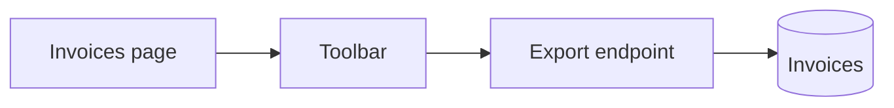

# Report: Export the invoice list as CSV

## Context

Accountants close each month from the invoice list, and until now they could only read it on screen. Every close began with someone copying rows by hand into a spreadsheet, and the copies drifted from the list whenever a filter changed.

## What was built

An accountant can now take the invoice list out of the app as a spreadsheet file, exactly as the page shows it.

- Export the invoices the current filter shows as a CSV file.
- Keep every amount with two decimals and its invoice currency.
- Download the file from an Export button on the invoices page, named after the export date.

## How it was built

The export is one endpoint beside the list endpoint, and it reads the same filter, so the page and the file cannot disagree. Rows stream from a database cursor rather than a loaded array, which a test holds to a fixed heap limit.

The button lives in the shared toolbar, which gained a slot for page actions. The toolbar owns the slot; the invoices page owns what it puts there.

## Where this differs from the plan

- The shared toolbar was widened with a slot for page actions, because the Export button had nowhere else to sit.
- The file keeps the export date in its name, as the plan says; the question was raised and answered during the run.

## How it was verified

The quoting of commas and quotes rests on authored tests only: no witness produced a field that needed it. The download itself could not be exercised in the headless browser, which saved no file.

## Architecture

The page asks the endpoint for the file with its own filter, and the endpoint streams rows from the database as it writes them.

- `IP` — the invoices page, which owns the filter.
- `TB` — the shared toolbar, with its new slot for page actions.
- `EX` — the export endpoint, which writes the CSV.
- `DB` — the invoices table, read through a cursor.

## What is unresolved

- The download was never exercised end to end; a browser that saves files has to confirm it.
- The next step is to name the file after the filter range if accountants ask for it.
